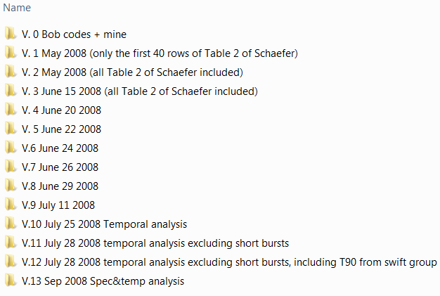

## Useful links for future reference
- [Linux commands cheat-sheet](linuxRef.pdf)
- [Git reference manual (2009)](progit.en.pdf)
- [GitHub's Git cheat-sheet](github-git-cheat-sheet.pdf)
- [Atlassian's Git cheat-sheet](atlassian_git_cheatsheet.pdf)
- [Markdown language cheat-sheet](markdown-cheatsheet-online.pdf)
- [Advanced Git cheatsheet](https://ndpsoftware.com/git-cheatsheet.html)  

## Motivation
Back in the early years of my graduate studies when I started scientific research and programming, the directory containing my first project looked something like the following figure.

<figure>
    
    <figcaption>
        An example of bad coding style and poor project maintenance. The figure shows part of the content of a directory dedicated to a research project. Each folder contains one version of the project and its corresponding codes and results at a given time (i.e., one <a href="https://en.wikipedia.org/wiki/Deliverable" target="_blank">deliverable</a>). Obviously, tracking minor development stages of the project leading to each of the deliverables would be a very difficult task with such project management method.
    </figcaption>
</figure>

Clearly, there are many disadvantages and caveats with maintaining the structure of your project and codes similar to the content of the above figure:

1. **Data redundancy and storage inefficiency**  
    Every time you want to develop your existing project and take it to the next level, you have to make a whole copy of the last version of your project to start the new development (i.e., the next version of your project). Obviously, the new version of your project will have a lot in common with the previous version. But, each one has its own dedicated separate folder. So, there is *a lot of code and data redundancy* in using such an approach to keeping track of your project's version history.
    <br><br>
2.  **High risk of errors and irreversible mistakes**  
    Using this method, it is easy to forget which directory you are in, and to accidentally write to the wrong file or to mistakenly overwrite files you did not mean to.
    <br><br>
3. **Difficulty in tracking minor developments in the project**  
    In professional programming, all minor developments and changes to a project must be tracked and well-documented (only the major versions of the project (called [deliverable](https://en.wikipedia.org/wiki/Deliverable) in programming terminology) are supposed to be available to non-developers or customers. This means that in order to keep track of every minor stage of the program development, one has to create a **new complete** copy of the project, with its own dedicated directory. However, since this is practically impossible, the programmer or the researcher has to either skip documenting all minor improvements and therefore, lose track of detailed changes in the code, or otherwise, worsen the first caveat mentioned above, by generating more and more redundant copies of the same codes and data for the sake of keeping track of all minor stages of the development.
    <br><br>
4. **Ambiguity in version differences**  
    With this primitive method of project version control, it is not clear what the main differences between different versions of the project are, unless a very detailed documentation is provided along with each version detailing the differences between the current, its ancestor (i.e., the previous version of the project) and its descendant (i.e., the next version of the project), or parallel independent versions of the project (i.e., the project [branches](https://en.wikipedia.org/wiki/Branching_(version_control))).
    <br><br>
5. **Sharing and collaboration difficulties**  
    Since the entire project is locally stored and accessible to one programmer or researcher, any collaborative effort will be extremely difficult, and require manual duplication and syncing of the project with other developers.
    <br><br>
6. **Potential risk of complete data loss:**  
    Since the project is stored locally, on a single computer or storage device, there is always a high risk of losing the entire project due to hardware failure, or other unpredicted events.
    <br><br>

Fortunately, several smart powerful solutions and software have been developed, collectively known as [Version Control System (VCS)](https://en.wikipedia.org/wiki/Version_control) for [project management](https://en.wikipedia.org/wiki/Software_configuration_management), in particular, since the dawn of the new millennium.
<br><br>

<a name="VCS"></a>
## What is Version Control System (VCS)?

Version control is a system (e.g., software) that records changes to a file or set of files over time so that you can recall specific versions later.<sup><a href="#fn1" id="ref1">1</a></sup>
Depending on how the project is maintained and shared with others, VCS is classified into three categories:

1. **Local VCS**  
    The simplest form of project version control, and probably the oldest method is *local VCS* where the VCS software keeps detailed track of the evolution of individual files in the project *only on a local storage device or computer*. A prime example of such version control software is the GNU [Revision Control System (RCS)](https://www.gnu.org/software/rcs/). Such VCS is able to avoid problems 1-4 mentioned above. The following figure illustrates the inner workings of a local VCS.  
    <br>
      
    <br>
    **Major Caveats:**  
    1. There is no easy way for collaboration and synchronization between team members.  
    2. There is a potential risk of complete data loss.  
    <br><br>  
2. **Centralized VCS (CVCS)**  
    Since collaborative effort is at the heart of almost every large-scale project, a new generation of VCS has been developed that go beyond the capabilities of local VCS. These VCS have a central repository that is accessible by all members of the project's team. This central repository contains all of the project's information and its development history and clients (team members) can check out and work on individual files of the project. For many years this style of VCS used to be the dominant method of software version control. Prime examples include [Concurrent Versions System (CVS)](https://en.wikipedia.org/wiki/Concurrent_Versions_System), [Perforce Helix](https://en.wikipedia.org/wiki/Perforce_Helix) and [Apache Subversion(SVN)](https://en.wikipedia.org/wiki/Apache_Subversion). The following figure illustrates the inner workings of a CVCS.  
    <br>
      
    <br>
    **Major Caveats:**  
    1. Since the main database of the project is centralized, and team members have only snapshots of a specific version of the project, any failure in the central database would halt the individual and the collaborative works of all team members as no further developments can be submitted to the central database.  
    2. Also, if the central database is completely corrupted with no backups, then the entire history of the project is lost.
    <br><br>  
3. **Distributed VCS (DVCS)**  
    In order to resolve the caveats of the aforementioned VCS, several new VCS, known as *distributed VCS*, have been developed within the first decade of the new millennium. With these VCS, each client has an entire copy of the central database at their own local storage device. Thus, every **clone** of the central repository that is with each client, is a full backup of all of the project's data and history.  Consequently, if the central server/repository fails for any reason, the local repository of the team member that has the most recent clone of the project database, can be used to restore the central repository. **This VCS paradigm is currently the most popular class of VCS**. We will be using a major implementation of it known as [**Git**](https://git-scm.com/) here. Other major DVCS implementations include [**Mercurial**](https://www.mercurial-scm.org/), [**Bazaar**](https://bazaar.canonical.com/en/), and [**Darcs**](http://darcs.net/). The following figure illustrates the inner working of a DVCS.  
    <br>
      
    <br>  

A rather complete list of all major VCS software implementations can be found [here](https://en.wikipedia.org/wiki/List_of_version_control_software).  

<a name="GM-VCS"></a>
## Git/Mercurial version control system

**Git** is a DVCS that grew out of frustration between the Linux kernel developing community and a proprietary VCS software company that maintained and indexed Linux kernel development. Similar to another major DVCS implementation [**Mercurial**](https://www.mercurial-scm.org/), Git is designed with the following goals in mind:

- Speed.
- Simple design.
- Strong support for non-linear development (thousands of parallel branches).
- Fully distributed.
- Able to handle large projects like the Linux kernel efficiently (speed and data size).

<a name="GM-indexingMethod"></a>
### Git/Mercurial project indexing method

VCS software, such as SVN and Bazaar, index the new developments of a given project by tracking the changes in individual files of the project, similar to the diagram below.

<figure>
    
    <figcaption>
        <b>File-based</b> project indexing method that is common to some VCS software such as CVS, Subversion, Perforce, Bazaar. (<i>Diagram is adopted from <a href="https://git-scm.com/doc" target="_blank">Git documentation</a></i>).
    </figcaption>
</figure>

By contrast, both Git and Mercurial work by generating a complete snapshot of the project at any moment the project is committed to the local repository for the purpose of version control. Even if some files have not changed in the new version of the project, they will still exist in the newly generated version of the project. However, both Git and Mercurial have been designed smart enough to realize what changes have occurred to individual files and then store the files effectively, without redundancy.  The complete history of the project is constructed by the series of snapshots generated, a flow that is similar to the following illustration.

<figure>
    
    <figcaption>
        <b>Snapshot-based</b> project indexing method that is used in Git and Mercurial VCS software. (<i>Diagram is adopted from <a href="https://git-scm.com/doc" target="_blank">Git documentation</a></i>).
    </figcaption>
</figure>

<a name="gitAreas"></a>
Each project's file in Git/Mercurial indexing process can have one of the three possible states:

1. **modified, but not staged:**
    This is when a project file is modified by the user, but Git/Mercurial has no track of the file changes at the moment. If the file is lost or removed unexpectedly, then Git cannot recover the file.
    <br><br>
    <a name="stagingArea"></a>
2. **staged for commit to the repository:**
    When a file is modified it can be added to the Git staging area to be later *committed* permanently to the repository. The staging area is a file, generally contained in the project's repository (`.git` directory), that stores information about what will go into the next *commit* to the repository. The staging area is also sometimes referred to as the **index**.
    <br><br>
3. **committed to the repository:** Once the staged files are *committed* to the repository, they become a permanent part of it and can be later extracted (i.e., checked out) for review or further development.

These three file states comprise an important integral part of Git and Mercurial. The following figure provides an illustration of these three file states.
<br>

<figure>
    
    <figcaption>
        A diagram illustrating the project-indexing process of Git and Mercurial VCS software. Each project file can reside in three different states: <b>working directory</b>, <b>staging area</b>, or in the <b>local repository</b>. (<i>Diagram is adopted from <a href="https://git-scm.com/doc" target="_blank">Git documentation</a></i>).
    </figcaption>
</figure>

<a name="remRepos"></a>
### Remote repository options for your Git/Mercurial projects

Git can be downloaded and installed from [here](https://git-scm.com/downloads) for Windows, Mac, or Linux systems. The installation guide is available [here](https://git-scm.com/book/en/v2/Getting-Started-Installing-Git). Mercurial can be downloaded and installed from [here](https://www.mercurial-scm.org/) for Windows, Mac, or other operating systems. For collaborative projects, you will need a central (remote) project-repository to which all team members submit their latest developments. **Even if you are working on a project alone, it is always a good idea to submit all of your project developments to a remote repository for the sake of avoiding unpredicted data loss, also for publicly showcasing your work.** Three popular online repositories for version-controlled projects are:

1. [**GitHub**](https://github.com/), which is also an Internet hosting service, works exclusively for projects that are indexed using Git VCS. As of today, all public projects (visible to everyone on the web) on GitHub are free-of-charge. For private projects, you will have to pay a monthly fee. However, [GitHub Student](https://github.com/blog/1900-the-best-developer-tools-now-free-for-students) offers a micro-account specially for students with five private repositories free-of-charge (normally $7/month) while you're a student.<br><br>
2. [**Bitbucket**](https://bitbucket.org/), which used to exclusively host Mercurial-indexed projects. But since 2011, it can also host Git-indexed projects. As of today, all projects, public or private (up to 5 users), can be stored on Bitbucket free-of-charge.   
3. [**GitLab**](https://about.gitlab.com/), is another rather-new  Git-repository manager that provides developer tools comparable wth GitHub, and even more. At the moment, it is not as popular as GitHub. However, it is used by many major companies and industries across the world for software version control (e.g., NASA, IBM, Boeing, CERN, Oracle, Sony, ...).

GitHub and Bitbucket are particularly useful for education as they provide notable services and options for educational accounts and purposes. The following is a concise comparison between the general features and services of GitHub and Bitbucket.  

<br>
<table class="center">
    <tbody>
        <tr>
            <td><strong>Feature</strong></td>
            <td><strong>Bitbucket</strong></td>
            <td><strong>GitHub</strong></td>
        </tr>
        <tr>
            <td>
                <strong>Supported VCS</strong>
            </td>
            <td>
                <em>Mercurial, Git</em>
            </td>
            <td>
                <em>Git</em>
            </td>
        </tr>
        <tr>
            <td>
                <strong>Public repos</strong>
            </td>
            <td>
                <em>Free, unlimited</em>
            </td>
            <td>
                <em>Free, unlimited</em>
            </td>
        </tr>
        <tr>
            <td>
                <strong>Private repos</strong>
            </td>
            <td>
                <em>Free up to 5 users</em>
            </td>
            <td>
                <em>Starts at $7/month for unlimited users</em>
            </td>
        </tr>
        <tr>
            <td>
                <strong>Popular projects hosted</strong>
            </td>
            <td>
                <em><span class="s1">Adium, Mailchimp, Opera, Python, Django</span></em>
            </td>
            <td>
                <em><span class="s1">Bootstrap, Node.js, jQuery, Rails, Homebrew</span></em>
            </td>
        </tr>
        <tr>
            <td>
                <strong>Notable Extra features</strong>
            </td>
            <td>
                <em><span class="s1">External authentication via GitHub, Twitter, Facebook, Google</span></em>
            </td>
            <td>
                <em><span class="s1">Two-factor authentication, GitHub Pages, GitHub Gists</span></em>
            </td>
        </tr>
    </tbody>
</table>


<a name="gitProjectSetup"></a>
## Setting up your first Git project on GitHub

Here, we will use Git as our version control software, and GitHub as our central (remote) repository. Follow the guidelines below to create your first Git project on GitHub.

1. Go to [GitHub Student](https://education.github.com/) and create your student account.
2. Download and install [Git](https://git-scm.com/downloads) on your computer.

<a name="gitID"></a>
### Setting up your Git identity

The first thing you should do when you install Git is to set your user-name and email address. This is important because every Git commit uses this information, and this information is permanently baked into the *commits* that will make to your projects' repository. To set your name and email globally for all Git projects *once and for all* on your computer, use the following Git commands:
```bash
$ git config --global user.name "Amir Shahmoradi"
$ git config --global user.email shahmoradi@utexas.edu
```

You need to do this only once if you pass the `--global` option because then Git will always use the provided information for anything you do with Git on your system. Later on, if you want to override this information with a different name or email address for some specific projects, you can run the above same Git commands, but *without the `--global` optional flag*, only **when you are in your specific project's directory**.

<a name="gitInit"></a>
### Two methods of project initialization

Now at this point, there are two ways for project initialization. We will go through both here. A good detailed tutorial can be found [here](https://www.atlassian.com/git/tutorials/setting-up-a-repository).  

If you intend to use GitHub as your remote repository server, you may find it much more straightforward to initiate your projects on GitHub first and then, clone them on your local device as opposed to initiating your repository locally and then pushing it to the remote repository server (GitHub). **So, if you don't know which one of the following to choose to initialize your projects, then go with the first option (remote project initialization on GitHub) as described below.**

#### Remote project initialization (on GitHub)  

With this method you first initialize an empty project on GitHub, and then clone the project from the remote (GitHub) repository to your local device, using the `git clone` command, discussed later below. To create a remote repository on GitHub, login to your GitHub account and follow the instructions on [this page](https://help.github.com/articles/create-a-repo/).

#### Local project initialization  

Local project initialization is done by the following git command:
```bash
$ git init
```

This command will initialize an empty repository in the current directory. If you check the directory containing your repository, you will notice that a new hidden  `.git` folder has been added to the directory. This folder will contain all of the history of your new project. Anything in the directory where the hidden `.git` folder exists will be indexed as part of the project.<br>
In order to generate the project's repository in a different directory, use
```bash
$ git init <directory name>
```

Even if the requested directory does not exist, git will first automatically create the requested directory and initialize an empty project inside of it. That's it! Now all you need to do is to start adding or developing your project files inside the project folder.

<a name="lorcalRemoteConnection"></a>
### Local device and remote repository SSH connection

<br>**Why is SSH needed?**  
Now every time may you want to **clone** your remote private repository to your local device or **push** your local repository to a remote server (your GitHub account), or basically do any communication between the local and remote repositories, Git will ask you to authenticate your connection by supplying your GitHub username and password. Note that this security check is necessary since you don't want just anyone to be able to push unwanted changes to your personal projects or mess with them without your prior permission.
However, this rather annoying user/pass request by Git can be resolved by setting up an **SSH** secure connection between your local device and the remote repository.  
SSH, also known as **Secure Shell** or **Secure Socket Shell**, is a network protocol that gives users a secure way to access a computer over an unsecured network. SSH may also refer to the suite of utilities that implement the SSH protocol.

**How does it work?**  
Think of your local device as a person who has a set of keys. Now, if your remote repository is a home with an entrance keyhole that matches one of the person's keys, then the person (i.e., your local device) can gain access to the interior of the home (i.e., your remote repository).  

**How is it set up?**  
You can generate keys for your local device by following the instructions given [here](https://help.github.com/articles/generating-a-new-ssh-key-and-adding-it-to-the-ssh-agent/). Once you have generated the key and the keyhole, you can add a copy of the keyhole to your GitHub account by following the instructions given [here](https://help.github.com/articles/adding-a-new-ssh-key-to-your-github-account/).

Here is an example educational video, explaining the SSH key setup process:

<br>
<div class="center">
    <div class="video-wrapper">
        <div class="video-container">
            <iframe width="853" height="480" src="https://www.youtube.com/embed/H5qNpRGB7Qw?rel=0" frameborder="0" allowfullscreen></iframe>
        </div>
    </div>
</div>
<br>

<a name="mainGitCommands"></a>
## Main Git commands

As of today, Git has more than 150 commands. For a complete list, you can type the following on your *Git bash* command window,
```bash
$ git help -a
```

to see a list of all possible Git commands. Note that every Git command begins with `git`. Despite the long list of Git commands, you will likely use only five of them on an everyday basis. Not that the rest are unimportant, but with these five basic commands you will be at least able to develop and index your project and communicate with your remote repository as well as your colleagues. In order to understand these five, we will have to recall the three states of a project's files, described earlier [above](#gitAreas).

<a name="git-status"></a>
### **git status**: Check the status of the project

First of all, you can check the status of your git project at any time by typing the following command in the git-bash prompt window, assuming the command line is already on the project's directory.
```bash
$ git status
```


<a name="git-add"></a>
### **git add**: Add files to the staging area

In order to add any of the modified or new files to the [staging area](#stagingArea), use
```bash
$ git add <file name>
```

To add all modified files (including file removals as well as changes) to the staging area, use
```bash
$ git add -A
```

or,
```bash
$ git add --all
```

This command is equivalent to
```bash
$ git add .
$ git add -u
```

The first command stages the new and modified files, but not the deleted files. The second command stages the modified and deleted files, without the newly-created files.

The full documentation for `git add` can be found [here](https://git-scm.com/docs/git-add).  

<a name="git-commit"></a>
### **git commit**: Commit the staged files to the local repository

The stages files can be committed (i.e., submitted permanently) to the local repository by
```bash
$ git commit
```

once this command is entered, a new page for *log message* will open on the command line, which contains the list of all files to be committed, and a place at the top of the page to add comments regarding this version of files that are being committed to the repository. To add a comment, press `i` to enter the *insert* mode of the **vim** text-editor. Once your comment is added to the text file, press `ESC` button to exit the insert mode, and write `:wq` on the command-line to **w**rite the comment file (i.e., save it) and **q**uit *vim* text-editor.

If you use,
```bash
$ git commit -a
```

or,
```bash
$ git commit -all
```

Both commands act as a shortcut to first automatically **stage files** that have been **modified and deleted** and then **commit** them to the repository, but **not the new files** that you have not yet told Git about. Another useful flag is `-m` with which you can enter a short message on the command line as the log message of the commit, and therefore no new page will open up for entering log message,
```bash
$ git commit -m "This is a test commit!"
```

The `-a` and `-m` flags can be combined to automatically stage and commit the files together,
```bash
$ git commit -am "This is a test commit!"
```

*But, keep in mind that with this method of staging, the **new files** will neither be staged nor committed to the repository.*

The full documentation for `git commit` can be found [here](https://git-scm.com/docs/git-commit).  

#### Using Notepad++ and Sublime along with Git to commit changes to Git repositories  

In recent years, Notepad++ has become a very popular general-purpose text-editor on Windows operating systems. As a result, Git has recently provided the users with the optional feature that enables Git commits messages to be crafted via Notepad++ software, instead of the lower-level command-line text-editing environment `vim`. To set Notepad++ as your default text-editor for Git, you will need to first [download]() and install Notepad++. Then on the Git Bash command-line type the following commands to set the default text-editor of Git to Notepad++,  

```bash
$ git config --global core.editor "C:\Program Files (x86)\Notepad++\notepad++.exe"
```

Note that you will have to modify the address provided above to point to the location where `notepad++.exe` exists on **your device**.  Notepad++ is only available on Windows systems. If you prefer to use text-editors other than `vim` on other operating-system platforms, you can follow the same command above but change the address to point to the path of the text-editor of your choice on your device. For example, if you are using Mac device, and you'd like to use Sublime text-editor, you can install Sublime first and then type the following command on the Git Bash command line,  

```
$ git config --global core.editor "/Applications/'Sublime Text.app'/Contents/SharedSupport/bin/subl -n -w"
```

where again, you will have to change the example address provided in the command above, in the double-quotation marks, to the path pointing the location where Sublime is installed **on your device**.  

<a name="git-push"></a>
### **git push**: Push the changes in local repository to the remote repository

Now, in order to *push* all your commits from the local repository to the remote repository, in order to place permanently there and be able to share it with others, use
```bash
$ git push --all
```

We have not yet talked about **git branches**, but what the above command basically does is that it orders Git to **push all branches of the project** to the remote repository. Later on, we will talk more about different flags that can follow `git push` command.

The full documentation for `git push` can be found [here](https://git-scm.com/docs/git-push). 

<a name="git-pull"></a>
### **git pull**: Pull the latest project revision from the remote to the local repository  

Sometimes, your project collaborators might be working simultaneously but independently on the project. In such cases, whenever you want to restart your work on your project, you may want to first *pull* the latest revision of the project -- that is not available yet in your local repository -- from the remote to your local repository. To do so, you can simply use
```bash
$ git pull
```

There are some important details about `git pull` which we will delve into later on in the following sections.

The full documentation for `git pull` can be found [here](https://git-scm.com/docs/git-pull). 

<a name="git-summary"></a>
### Summary of main Git commands  
All in all, the most trivial, but also the most useful git commands are the following:
```bash
$ git status
$ git add --all
$ git commit
$ git push --all
```

for submitting your changes to the local and remote repositories, and
```bash
$ git pull
```

for syncing your local with the remote repository. Remember that you have to use these commands, in the above forms, **inside the directory of the project **.


## Getting help with Git commands  

There are basically three ways to request information about Git commands on the Git-bash command line:
```bash
$ git help <command name>
$ git <command name> --help
$ man git-<command name>
```
Note that the last command `man` is not a Git command, but a [Bash environment](https://en.wikipedia.org/wiki/Bash_(Unix_shell)) command. Just as a reminder, all Git commands begin with the word *git*.

## Viewing the Git commit history  

You can check the history of your project's commits to the repository using the Git command `git log`.
For example, here is a snippet from the output  of `git log` on my laptop screen:
```bash
  $ git log
commit 264043e0d49006b7f59e57639961c333b5d5f124
Author: Amir Shahmoradi <a.shahmoradi@gmail.com>
Date:   Tue Jan 24 17:48:33 2017 -0600

    data tables for 1D model added.

commit b45ddd780c18736bac42ff27aade301a6b0f09cb
Author: Amir Shahmoradi <a.shahmoradi@gmail.com>
Date:   Tue Jan 24 10:08:53 2017 -0600

    minor edit

commit b6f4fb69d97a396bde7159c78424100704328634
Author: Amir Shahmoradi <a.shahmoradi@gmail.com>
Date:   Thu Jan 12 21:03:28 2017 -0600

    *.txt files removed

commit 961ff2d4ac68081a21864b2f1b067b43424d3342
Author: Amir Shahmoradi <a.shahmoradi@gmail.com>
Date:   Thu Jan 12 21:02:00 2017 -0600

    update

commit 8fd3c49e90d96f4bcef2302c7b227f06ad7a5250
Author: Amir Shahmoradi <a.shahmoradi@gmail.com>
Date:   Thu Jan 12 19:36:45 2017 -0600

    minor

commit cd0ed7def385ba29ea134bcc18a4ad0873d9f5ee
Author: Amir Shahmoradi <a.shahmoradi@gmail.com>
Date:   Thu Jan 12 19:32:51 2017 -0600

    minor

commit 8096668868ef64189f788669d5f1838cd944f9b6
Author: Amir Shahmoradi <a.shahmoradi@gmail.com>
Date:   Thu Jan 12 19:28:22 2017 -0600

    minor

commit c52ba6adea474625cce1493896ecaac40cb976af
Author: Amir Shahmoradi <a.shahmoradi@gmail.com>
Date:   Thu Jan 12 19:24:23 2017 -0600

    minor

commit ab5a17f9e913e55cae0f971fd9b485a0a6e8dec3
Author: Amir Shahmoradi <a.shahmoradi@gmail.com>
Date:   Thu Jan 12 19:16:27 2017 -0600

    minor

commit ce5c2421db6e76a338a0e6922acead9100a7c4c4
Author: Amir Shahmoradi <a.shahmoradi@gmail.com>
Date:   Thu Jan 12 19:10:19 2017 -0600

    minor

commit 4a7d27d81260c2e2a29b6259e6c97befc065c069
Author: Amir Shahmoradi <a.shahmoradi@gmail.com>
Date:   Thu Jan 12 19:05:14 2017 -0600

:
```

There is a long list of options that can be used with `git log` command to display exactly what you need on the Bash environment screen.
Some of the most useful options are discussed below.  
To lists the differences between different commits of the same file, use `-p` flag:  
```bash
$ git log -p
```

To list only a limited count of the most recent commits use `-<number of commits to display>` flag. For example:  
```bash
$ git log -2
$ git log -2
commit 264043e0d49006b7f59e57639961c333b5d5f124
Author: Amir Shahmoradi <a.shahmoradi@gmail.com>
Date:   Tue Jan 24 17:48:33 2017 -0600

    data tables for 1D model added.

commit b45ddd780c18736bac42ff27aade301a6b0f09cb
Author: Amir Shahmoradi <a.shahmoradi@gmail.com>
Date:   Tue Jan 24 10:08:53 2017 -0600

    minor edit
```  
<br>
To list the statistics of the commits, use,
```bash
$ git log --stat -1
commit 264043e0d49006b7f59e57639961c333b5d5f124
Author: Amir Shahmoradi <a.shahmoradi@gmail.com>
Date:   Tue Jan 24 17:48:33 2017 -0600

    data tables for 1D model added.

 README.md                |   1 +
 results/tables/README.md |   8 ++-
 results/tables/tgm.mat   | Bin 0 -> 2550889 bytes
 src/defineProject.m      |   3 +-
 src/main.m               |  82 +++++++++------------------
 src/writeTables.m        |  75 ++++++++++++++++++++++++
 9 files changed, 140 insertions(+), 56 deletions(-)
```  
<br>
The log data can be even represented in formatted style via the flag `--pretty=format:"<the desired format>"`. For example,
```bash
$ git log -3 --pretty=format:"%h - %an, %ar : %s"
264043e - Amir Shahmoradi, 7 days ago : data tables for 1D model added.
b45ddd7 - Amir Shahmoradi, 7 days ago : minor edit
b6f4fb6 - Amir Shahmoradi, 3 weeks ago : *.txt files removed
```

A list of available format options is provided below:

<table class="center">
    <caption class="title" style="padding-bottom:10px">
        Some useful options for <code>git log --pretty=format:"&lt;options&gt;"</code>. <sup><a href="#fn2" id="ref2">2</a></sup>
    </caption>
    <thead>
        <tr>
            <th>Option</th>
            <th>Description of Output</th>
        </tr>
    </thead>
    <tbody>
    <tr>
        <td><code>%H</code></td>
        <td>Commit hash</td>
    </tr>
    <tr>
        <td><code>%h</code></td>
        <td>Abbreviated commit hash</td>
    </tr>
    <tr>
        <td><code>%T</code></td>
        <td>Tree hash</td>
    </tr>
    <tr>
        <td><code>%t</code></td>
        <td>Abbreviated tree hash</td>
    </tr>
    <tr>
        <td><code>%P</code></td>
        <td>Parent hashes</td>
    </tr>
    <tr>
        <td><code>%p</code></td>
        <td>Abbreviated parent hashes</td>
    </tr>
    <tr>
        <td><code>%an</code></td>
        <td>Author name</td>
    </tr>
    <tr>
        <td><code>%ae</code></td>
        <td>Author email</td>
    </tr>
    <tr>
        <td><code>%ad</code></td>
        <td>Author date (format respects the --date=option)</td>
    </tr>
    <tr>
        <td><code>%ar</code></td>
        <td>Author date, relative</td>
    </tr>
    <tr>
        <td><code>%cn</code></td>
        <td>Committer name</td>
    </tr>
    <tr>
        <td><code>%ce</code></td>
        <td>Committer email</td>
    </tr>
    <tr>
        <td><code>%cd</code></td>
        <td>Committer date</td>
    </tr>
    <tr>
        <td><code>%cr</code></td>
        <td>Committer date, relative</td>
    </tr>
    <tr>
        <td><code>%s</code></td>
        <td>Subject</td>
</tr>
</tbody>
</table>
<br>
A list of useful options for `git log` is given in the table below.

<table id="log_options" class="center">
    <caption class="title" style="padding-bottom:10px">
        Table 2: Common flags for <code>git log</code> command. <sup><a href="#fn1" id="ref1">1</a></sup>
    </caption>
    <colgroup>
        <col style="width: 20%;">
        <col style="width: 80%;">
    </colgroup>
    <thead>
        <tr>
            <th>Option</th>
            <th>Description</th>
        </tr>
    </thead>
    <tbody>
        <tr>
                <td><code>-p</code></td>
                <td>Show the patch introduced with each commit.</td>
            </tr>
            <tr>
                <td><code>--stat</code></td>
                <td>Show statistics for files modified in each commit.</td>
            </tr>
            <tr>
                <td><code>--shortstat</code></td>
                <td>Display only the changed/insertions/deletions line from the --stat command.</td>
            </tr>
            <tr>
                <td><code>--name-only</code></td>
                <td>Show the list of files modified after the commit information.</td>
            </tr>
            <tr>
                <td><code>--name-status</code></td>
                <td>Show the list of files affected with added/modified/deleted information as well.</td>
            </tr>
            <tr>
                <td><code>--abbrev-commit</code></td>
                <td>Show only the first few characters of the SHA-1 checksum instead of all 40.</td>
            </tr>
            <tr>
                <td><code>--relative-date</code></td>
                <td>Display the date in a relative format (for example, “2 weeks ago”) instead of using the full date format.</td>
            </tr>
            <tr>
                <td><code>--graph</code></td>
                <td>Display an ASCII graph of the branch and merge history beside the log output.</td>
            </tr>
            <tr>
                <td><code>--pretty</code></td>
                <td>Show commits in an alternate format. Options include oneline, short, full, fuller, and format (where you specify your own format).</td>
        </tr>
    </tbody>
</table>
<br>

A list of useful options for `git log` commands that can change the format of the output, is given in the table below.

<table id="limit_options" class="center">
    <caption class="title" style="padding-bottom:10px">
        Table 3. Flags limiting the output of <code>git log</code> command. <sup><a href="#fn1" id="ref1">1</a></sup>
    </caption>
    <colgroup>
        <col style="width: 33.3333%;">
        <col style="width: 66.6667%;">
    </colgroup>
    <thead>
        <tr>
            <th class="tableblock halign-left valign-top">Option</th>
            <th class="tableblock halign-left valign-top">Description</th>
        </tr>
    </thead>
    <tbody>
        <tr>
            <td><code>-&lt;n&gt;</code></td>
            <td>Show only the last n commits  (e.g., -2, -3, ...). </td>
        </tr>
        <tr>
            <td><code>--since</code>, <code>--after</code></td>
            <td>Limit the commits to those made after the specified date.</td>
        </tr>
        <tr>
            <td><code>--until</code>, <code>--before</code></td>
            <td>Limit the commits to those made before the specified date.</td>
        </tr>
        <tr>
            <td><code>--author</code></td>
            <td>Only show commits in which the author entry matches the specified string.</td>
        </tr>
        <tr>
            <td><code>--committer</code></td>
            <td>Only show commits in which the committer entry matches the specified string.</td>
        </tr>
        <tr>
            <td><code>--grep</code></td>
            <td>Only show commits with a commit message containing the string.</td>
        </tr>
        <tr>
                <td><code>-S</code></td>
                <td>Only show commits adding or removing code matching the string.</td>
        </tr>
    </tbody>
</table>
<br>
For example, to list the commit history since a specific time in the past, use `--since` flag:
```bash
$ git log --since=2.weeks
commit 264043e0d49006b7f59e57639961c333b5d5f124
Author: Amir Shahmoradi <a.shahmoradi@gmail.com>
Date:   Tue Jan 24 17:48:33 2017 -0600

    data tables for 1D model added.

commit b45ddd780c18736bac42ff27aade301a6b0f09cb
Author: Amir Shahmoradi <a.shahmoradi@gmail.com>
Date:   Tue Jan 24 10:08:53 2017 -0600

    minor edit
```

or, with the following date format:
```bash
$ git log --since="2017-01-15"
```


## Undoing, amending, and tagging  

Suppose you want to undo the latest addition of files to the staging area of your Git repository. The command that you need to use to clean the stage area is,
```bash
$ git reset
```

This command is basically the opposite of `git add`. There are a lot of options that can accompany this Git command, details of which can be found in [Git documentation](https://git-scm.com/docs/git-reset).
However, **be careful when using this command**, especially with flag `--hard`, which can result in changes in your working directory as well, thus leading to **involuntary loss of latest uncommitted files**.  

Another useful command is,
```bash
$ git commit --amend
```

which is used when you forget to add some files to your latest commit and now, you would like to add the latest content of your project's staging area to the last commit, by *amending* it.  

The Git command `git tag` allows you to tag specific important commits in your project's commit history, for example, a final release of your project (e.g., software). If you just type `git tag` on Git bash command line, it will list all tags in the project, **in alphabetical order**,
```bash
$ git tag
v1.0
v1.1
v2.0
```

You can create a tag for the latest commit to your repository by using,
```bash
git tag -a v3.0 -m "new version of the project"
```

This will add a new tag pointing to the latest commit in the project with name `v3.0` and the message *new version of the project*.
Now if you want to display the information about a specific tag, use `git show`,
```bash
$ git show v1.0
tag v1.0
Tagger: Amir Shahmoradi <a.shahmoradi@gmail.com>
Date:   Tue Jan 1 18:08:00 2017 -0600

first tag

commit 25129a074aece69d234838764e7df63ed1fb3023
Author: Amir Shahmoradi <a.shahmoradi@gmail.com>
Date:   Fri Dec 27 17:12:08 2016 -0600

    Update README.md
```

You can also create a **lightweight** tag by avoiding `-a`, `-s`, or `-m` flags in your tag command,
```bash
git tag v4.0
```

Annotated tags (created with `-a` flag) are meant for very important project versions, such as a software release, while lightweight tags are meant for private or temporary object labels.  
For more information about `git tag`, see [Git documentation](https://git-scm.com/docs/git-tag).
<br>

## Working with remote Repositories

In order to see which remote servers you have configured for your project, you can run the following Git command,
```bash
$ git remote
origin
```

In the output above, `origin` is the default name that Git gives to the server from which you cloned your the project. If you also specify `-v` flag, Git will show you the URLs that Git has stored corresponding to the remote's short name (e.g., origin). This URL is used to read from or write to the remote repository.
```bash
$ git remote -v
origin  git@github.com:shahmoradi/foo.git (fetch)
origin  git@github.com:shahmoradi/foo.git (push)
```

In order to see more information about the remote repository of your project, you can use,
```bash
$ git remote show origin
* remote origin
  Fetch URL: git@github.com:shahmoradi/foo.git
  Push  URL: git@github.com:shahmoradi/foo.git
  HEAD branch: master
  Remote branches:
    development tracked
    master      tracked
  Local branch configured for 'git pull':
    master merges with remote master
  Local ref configured for 'git push':
    master pushes to master (up to date)
```

The above information indicates that the current HEAD branch of the project is on *master* branch, and the remote branches on the remote repository are *master* and *development*.  

You can find more information about `git remote` command in [Git documentation](https://git-scm.com/docs/git-remote).
<br>

## Git branching

Branching is a powerful idea in the Version Control System which significantly facilitates collaboration or parallel development of a project. Suppose you have already a project which has reached its first release version, meaning that it works all fine. Now, you like to add a new feature to your project. To do this and to avoid further commits to your original project, you can create a new **branch** of the project which is specifically devoted to adding the new feature. See the following figure, for an example of Git branching.  

<figure>
    
    <figcaption style="text-align:center">
        An example illustration of Git branching for a project with three branches: master, development, topic.
    </figcaption>
</figure>

When you create a Git project, the default single branch in your project is **master**. So, for example, if you search for your project branches, you'd see,
```bash
$ git branch
* master
```

If you have already created other branches in your project, for example, **development**, then you may see a Git message like the following,
```bash
$ git branch
* development
  master
```

The **\*** behind the branch name indicates that the **project HEAD (i.e., your working directory)** points to that branch. This means that all commits will be made to that branch highlighted by **\***. In the example above, the working directory points to the *development* branch.  

### Creating a new branch

In order to **create a new branch** in your project, use,
```bash
$ git branch <branch name>
```

For example,
```bash
$ git branch development
```

When you create a new branch, Git creates an exact duplicate of the current branch that you are in, but with the requested name for the new branch.  

### Checking out a branch

In order to **switch to a specific Git branch** in your project, use,
```bash
$ git checkout <branch name>
```

For example,
```bash
$ git checkout development
Switched to branch 'development'
```

A shortcut for **both creating a new branch from the current branch, and switching to the new branch automatically** is to use,
```bash
$ git checkout -b <branch name>
```

```bash
$ git checkout -b test
Switched to a new branch 'test'
```

Now suppose, you have made some significant progress on your project **development** branch, and now you want to add the newly-developed feature in the development branch to your **master** branch. All you need to do is,
```bash
$ git checkout master
$ git merge development
```

By doing this, you first switch to master branch, then request Git to **merge** all changes made to the project on the *development* branch to be copied and transferred to the *master* branch. For example, if I have added a single `test.txt` file, and committed the change to the development branch, then upon merging it with the master branch, Git will display a message like the following,
```bash
$ git merge development
Updating 25129a0..57ed7c2
Fast-forward
 test.txt | 2 ++
 1 file changed, 2 insertions(+)
 create mode 100644 test.txt
```

Now suppose there was no change in the development branch ever since branching it from the master branch. Then upon merging, you would get a message like the following,
```bash
$ git merge development
Already up-to-date.
```

Occasionally, conflicts may arise between branches upon merging. This happens when a common file between the two branches, has been modified on both branches in parallel. In such cases, you will need to resolve the conflict by choosing one of the file edits in one of the branches and discard the other. The following is an example merge conflict message by Git.
```bash
$ git merge development
Auto-merging test.txt
CONFLICT (content): Merge conflict in test.txt
Automatic merge failed; fix conflicts and then commit the result.
```

For example, if you use `git status` command, the following is the typical message that will be displayed,
```bash
$ git status
On branch test
You have unmerged paths.
  (fix conflicts and run "git commit")
  (use "git merge --abort" to abort the merge)

Unmerged paths:
  (use "git add <file>..." to mark resolution)

        both modified:   test.txt

no changes added to commit (use "git add" and/or "git commit -a")
```

To resolve the conflict, open the conflicting file. There you will see segments of the file from both versions which are the cause of the conflict. Edit the file as you wish. and then perform the normal `git add` and `git commit` on the file, to resolve the conflict and complete the merge process.  

In addition to `git merge`, there is another more elegant and powerful Git command, `git rebase` for integrating changes in different branches into a single branch. But, the subject goes beyond the goals of this class, and the interested reader is referred to [Git documentation](https://git-scm.com/docs/git-rebase) for this command and [this pedagogical Git page](https://git-scm.com/book/en/v2/Git-Branching-Rebasing) for `git rebase`.

### Deleting a branch
Normally, when a branch merge is done, the development branch is not needed anymore, so it is always wise and cleaner to delete the unwanted branches, using the command `git branch -d <branch name>`. To do this, check out the same branch on which you just performed `git merge`, then delete the other unwanted branch,
```bash
$ git checkout master
Your branch is ahead of 'origin/master' by 1 commit.
  (use "git push" to publish your local commits)
Switched to branch 'master'
$ git branch -d test
Deleted branch hotfix (3a0874c).
```

**Note that you cannot delete a branch while you are on it (i.e., while it is checked out)**. If you do so, Git will print out an error message like the following on screen,
```bash
$ git branch -d test
error: Cannot delete branch 'test' checked out at 'C:/Users/Amir/git/foo'
```

**You cannot delete a branch from another branch with which you have not performed the merging either**. In this case, Git will print the following error,
```bash
$ git branch -d test
error: The branch 'test' is not fully merged.
If you are sure you want to delete it, run 'git branch -D test'.
```


    <b>Advice for good project management</b><br>
    Your <i>master</i> branch should always contain the latest clean version of your project, that is, the complete and working version/release. You should always make your new developments in a separate branch, and once it works and the new feature/development is complete, you merge the new development into the master branch.

<br>

**Footnotes**

<sup id="fn1" style="font-size:1em">
    1. For a thorough review of VCS and particularly Git, see the [Git documentation]( https://git-scm.com/book/en/v2/Getting-Started-About-Version-Control). <a href="#ref1" title="Jump back to footnote 2 in the text.">↩</a>
</sup>  
<sup id="fn2" style="font-size:1em">
    2. See <a href="https://git-scm.com/docs/git-log" target="_blank">Git documentation</a> for more details and updates. <a href="#ref2" title="Jump back to footnote 2 in the text.">↩</a>
</sup>

<!--
[^2]: <span style="font-size:0.7em">For a short history of Git see [Git history](https://git-scm.com/book/en/v2/Getting-Started-A-Short-History-of-Git).</span>
-->

## Exercise  

1. Version-control using Git and GitHub: [web-link](https://www.cdslab.org/recipes/programming/version-control-using-git-github/version-control-using-git-github)  

1. Simple GitHub page from README.md: [web-link](https://www.cdslab.org/recipes/programming/github-readme-webpage/github-readme-webpage)  
