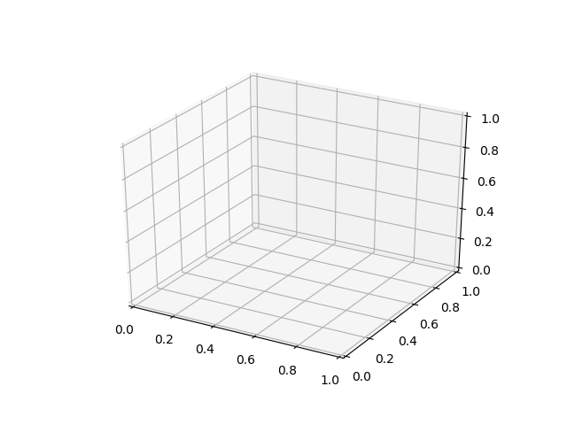
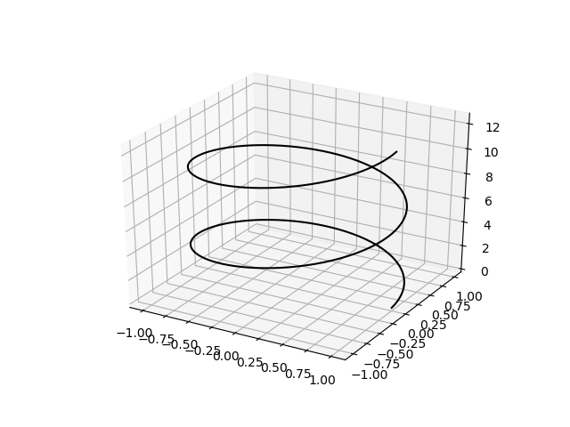
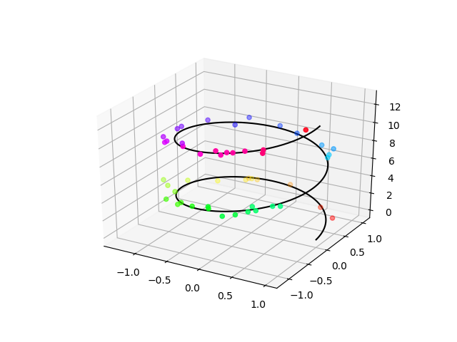
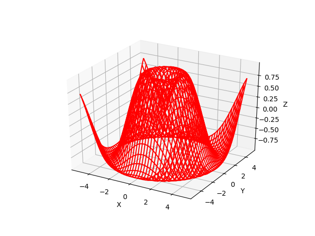
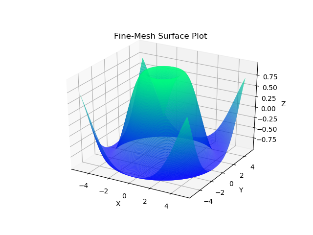
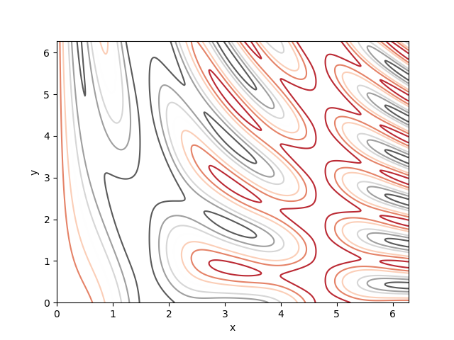
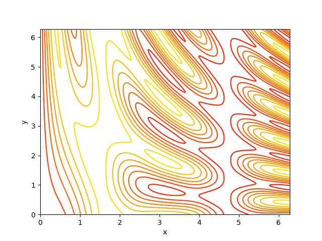
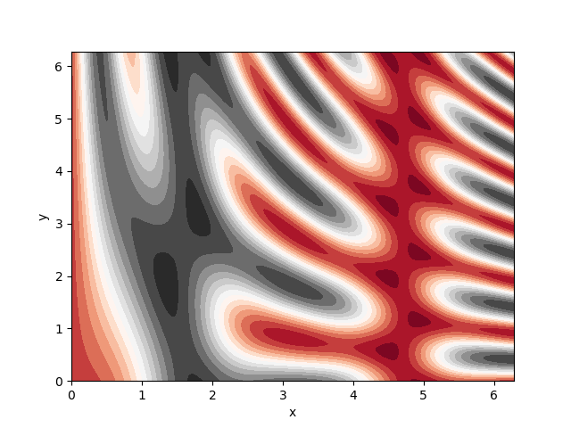
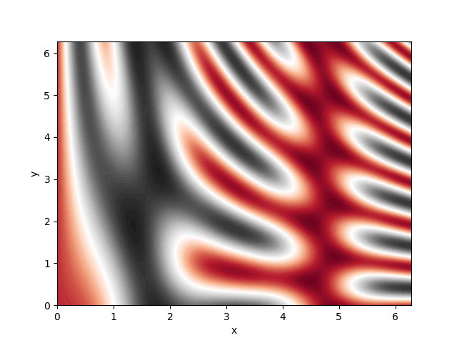

## 3D-plotting in `matplotlib`  

Over the past few years `matplotlib` has significantly grown to include additional plotting capabilities including 3D plotting techniques. At this point in the Python learning process, it is generally more sensible to learn the latest techniques of the advanced Python packages (including `matplotlib`) directly from their reference manual. The reason for this is that the interfaces for many of these packages are constantly evolving and any code that may work today, may not be functional in a few months or years. With this note in mind, the following is a quick overview of some of these plotting functionalities.  


If you are using Jupyter notebooks as your primary interface to Python interpreter, consider adding `%matplotlib notebook` to the beginning of your Jupyter notebook. This **IPython magic** will make all the plots that will be generated in the notebook interactive, meaning that you will be able to zoom in and out, resize, or rotate the plots inside the notebook.


### Creating 3D figure objects  

To generate 3D figures, you will have to import `mpl_toolkits` Python package,  

```python
%matplotlib notebook
import matplotlib.pyplot as plt
from mpl_toolkits import mplot3d
fig = plt.figure()
ax = plt.axes(projection="3d")

plt.show()
```

This should generate the following figure handle for you,

<figure>
    
</figure>

To save the plot in an external file, use the `savefig()` method.  

```python
plt.savefig('emptyFigure3D.png')
```

### Creating 3D line plots  

Now suppose we want to visualize a 3D line which is described by the following equations,  

```python
import numpy as np
zmin = 0.0
zmax = 4*np.pi
LineZ = np.linspace(zmin, zmax, 500)
LineY = np.sin(LineZ)
LineX = np.cos(LineZ)
```

If you look carefully, you may notice that the X and Y coordinates described by the above equations describe a circular, repeating, line. On the contrary, the Z coordinates are described by a set of monotonically increasing values. Therefore, this 3D line must be describing a spring-like object. To plot this object, we can use the following,  

```python
%matplotlib notebook
import matplotlib.pyplot as plt
from mpl_toolkits import mplot3d
fig = plt.figure()
ax = plt.axes(projection="3d")
ax.plot3D( x_line, y_line, z_line, 'gray')
plt.show()
plt.savefig('line3D.png')
```

which would give a plot like the following,  

<figure>
    
</figure>

### Creating 3D scatter plots  

Now, suppose we want to add a set of points to this line plot. For example, we could create a set of random points around the 3D line and visualize them, as if the random points are a set of observational data and the 3D line represents a mathemtical fit to this observational dataset,  

```python
import numpy as np
nPoint = 300 # number of random points
PointZ = zmin + (zmax-zmin) * np.random.random(nPoint)      # points have uniformly-distributed random heights along the Z axis
PointY = np.sin(PointZ) + 0.1 * np.random.randn(nPoint)     # points have normally-distributed random values along the Y axis
PointX = np.cos(PointZ) + 0.1 * np.random.randn(nPoint)     # points have normally-distributed random values along the X axis
ax.scatter3D( PointX, PointY, PointZ
            , c=PointZ      # color value of individual points is taken from their heights
            , cmap="hsv"    # the color mapping to be used. Other example options: winter, autumn, ...
            );
plt.show()
plt.savefig('lineScatter3D.png')
```

<figure>
    
</figure>

To get a full list of all color-maps that you can use and information about them, try,  

```python
help(plt.colormaps)
```
    Help on function colormaps in module matplotlib.pyplot:

    colormaps()
        Matplotlib provides a number of colormaps, and others can be added using
        :func:`~matplotlib.cm.register_cmap`.  This function documents the built-in
        colormaps, and will also return a list of all registered colormaps if
        called.
        
        You can set the colormap for an image, pcolor, scatter, etc,
        using a keyword argument::
        
          imshow(X, cmap=cm.hot)
        
        or using the :func:`set_cmap` function::
        
          imshow(X)
          pyplot.set_cmap('hot')
          pyplot.set_cmap('jet')
        
        In interactive mode, :func:`set_cmap` will update the colormap post-hoc,
        allowing you to see which one works best for your data.
        
        All built-in colormaps can be reversed by appending ``_r``: For instance,
        ``gray_r`` is the reverse of ``gray``.
        
        There are several common color schemes used in visualization:
        
        Sequential schemes
          for unipolar data that progresses from low to high
        Diverging schemes
          for bipolar data that emphasizes positive or negative deviations from a
          central value
        Cyclic schemes
          for plotting values that wrap around at the endpoints, such as phase
          angle, wind direction, or time of day
        Qualitative schemes
          for nominal data that has no inherent ordering, where color is used
          only to distinguish categories
        
        Matplotlib ships with 4 perceptually uniform color maps which are
        the recommended color maps for sequential data:
        
          =========   ===================================================
          Colormap    Description
          =========   ===================================================
          inferno     perceptually uniform shades of black-red-yellow
          magma       perceptually uniform shades of black-red-white
          plasma      perceptually uniform shades of blue-red-yellow
          viridis     perceptually uniform shades of blue-green-yellow
          =========   ===================================================
        
        The following colormaps are based on the `ColorBrewer
        <http://colorbrewer2.org>`_ color specifications and designs developed by
        Cynthia Brewer:
        
        ColorBrewer Diverging (luminance is highest at the midpoint, and
        decreases towards differently-colored endpoints):
        
          ========  ===================================
          Colormap  Description
          ========  ===================================
          BrBG      brown, white, blue-green
          PiYG      pink, white, yellow-green
          PRGn      purple, white, green
          PuOr      orange, white, purple
          RdBu      red, white, blue
          RdGy      red, white, gray
          RdYlBu    red, yellow, blue
          RdYlGn    red, yellow, green
          Spectral  red, orange, yellow, green, blue
          ========  ===================================
        
        ColorBrewer Sequential (luminance decreases monotonically):
        
          ========  ====================================
          Colormap  Description
          ========  ====================================
          Blues     white to dark blue
          BuGn      white, light blue, dark green
          BuPu      white, light blue, dark purple
          GnBu      white, light green, dark blue
          Greens    white to dark green
          Greys     white to black (not linear)
          Oranges   white, orange, dark brown
          OrRd      white, orange, dark red
          PuBu      white, light purple, dark blue
          PuBuGn    white, light purple, dark green
          PuRd      white, light purple, dark red
          Purples   white to dark purple
          RdPu      white, pink, dark purple
          Reds      white to dark red
          YlGn      light yellow, dark green
          YlGnBu    light yellow, light green, dark blue
          YlOrBr    light yellow, orange, dark brown
          YlOrRd    light yellow, orange, dark red
          ========  ====================================
        
        ColorBrewer Qualitative:
        
        (For plotting nominal data, :class:`ListedColormap` is used,
        not :class:`LinearSegmentedColormap`.  Different sets of colors are
        recommended for different numbers of categories.)
        
        * Accent
        * Dark2
        * Paired
        * Pastel1
        * Pastel2
        * Set1
        * Set2
        * Set3
        
        A set of colormaps derived from those of the same name provided
        with Matlab are also included:
        
          =========   =======================================================
          Colormap    Description
          =========   =======================================================
          autumn      sequential linearly-increasing shades of red-orange-yellow
          bone        sequential increasing black-white color map with
                      a tinge of blue, to emulate X-ray film
          cool        linearly-decreasing shades of cyan-magenta
          copper      sequential increasing shades of black-copper
          flag        repetitive red-white-blue-black pattern (not cyclic at
                      endpoints)
          gray        sequential linearly-increasing black-to-white
                      grayscale
          hot         sequential black-red-yellow-white, to emulate blackbody
                      radiation from an object at increasing temperatures
          jet         a spectral map with dark endpoints, blue-cyan-yellow-red;
                      based on a fluid-jet simulation by NCSA [#]_
          pink        sequential increasing pastel black-pink-white, meant
                      for sepia tone colorization of photographs
          prism       repetitive red-yellow-green-blue-purple-...-green pattern
                      (not cyclic at endpoints)
          spring      linearly-increasing shades of magenta-yellow
          summer      sequential linearly-increasing shades of green-yellow
          winter      linearly-increasing shades of blue-green
          =========   =======================================================
        
        A set of palettes from the `Yorick scientific visualisation
        package <https://dhmunro.github.io/yorick-doc/>`_, an evolution of
        the GIST package, both by David H. Munro are included:
        
          ============  =======================================================
          Colormap      Description
          ============  =======================================================
          gist_earth    mapmaker's colors from dark blue deep ocean to green
                        lowlands to brown highlands to white mountains
          gist_heat     sequential increasing black-red-orange-white, to emulate
                        blackbody radiation from an iron bar as it grows hotter
          gist_ncar     pseudo-spectral black-blue-green-yellow-red-purple-white
                        colormap from National Center for Atmospheric
                        Research [#]_
          gist_rainbow  runs through the colors in spectral order from red to
                        violet at full saturation (like *hsv* but not cyclic)
          gist_stern    "Stern special" color table from Interactive Data
                        Language software
          ============  =======================================================
        
        A set of cyclic color maps:
        
          ================  =================================================
          Colormap          Description
          ================  =================================================
          hsv               red-yellow-green-cyan-blue-magenta-red, formed by
                            changing the hue component in the HSV color space
          twilight          perceptually uniform shades of
                            white-blue-black-red-white
          twilight_shifted  perceptually uniform shades of
                            black-blue-white-red-black
          ================  =================================================
        
        
        Other miscellaneous schemes:
        
          ============= =======================================================
          Colormap      Description
          ============= =======================================================
          afmhot        sequential black-orange-yellow-white blackbody
                        spectrum, commonly used in atomic force microscopy
          brg           blue-red-green
          bwr           diverging blue-white-red
          coolwarm      diverging blue-gray-red, meant to avoid issues with 3D
                        shading, color blindness, and ordering of colors [#]_
          CMRmap        "Default colormaps on color images often reproduce to
                        confusing grayscale images. The proposed colormap
                        maintains an aesthetically pleasing color image that
                        automatically reproduces to a monotonic grayscale with
                        discrete, quantifiable saturation levels." [#]_
          cubehelix     Unlike most other color schemes cubehelix was designed
                        by D.A. Green to be monotonically increasing in terms
                        of perceived brightness. Also, when printed on a black
                        and white postscript printer, the scheme results in a
                        greyscale with monotonically increasing brightness.
                        This color scheme is named cubehelix because the r,g,b
                        values produced can be visualised as a squashed helix
                        around the diagonal in the r,g,b color cube.
          gnuplot       gnuplot's traditional pm3d scheme
                        (black-blue-red-yellow)
          gnuplot2      sequential color printable as gray
                        (black-blue-violet-yellow-white)
          ocean         green-blue-white
          rainbow       spectral purple-blue-green-yellow-orange-red colormap
                        with diverging luminance
          seismic       diverging blue-white-red
          nipy_spectral black-purple-blue-green-yellow-red-white spectrum,
                        originally from the Neuroimaging in Python project
          terrain       mapmaker's colors, blue-green-yellow-brown-white,
                        originally from IGOR Pro
          ============= =======================================================
        
        The following colormaps are redundant and may be removed in future
        versions.  It's recommended to use the names in the descriptions
        instead, which produce identical output:
        
          =========  =======================================================
          Colormap   Description
          =========  =======================================================
          gist_gray  identical to *gray*
          gist_yarg  identical to *gray_r*
          binary     identical to *gray_r*
          =========  =======================================================
        
        .. rubric:: Footnotes
        
        .. [#] Rainbow colormaps, ``jet`` in particular, are considered a poor
          choice for scientific visualization by many researchers: `Rainbow Color
          Map (Still) Considered Harmful
          <http://ieeexplore.ieee.org/document/4118486/?arnumber=4118486>`_
        
        .. [#] Resembles "BkBlAqGrYeOrReViWh200" from NCAR Command
          Language. See `Color Table Gallery
          <https://www.ncl.ucar.edu/Document/Graphics/color_table_gallery.shtml>`_
        
        .. [#] See `Diverging Color Maps for Scientific Visualization
          <http://www.kennethmoreland.com/color-maps/>`_ by Kenneth Moreland.
        
        .. [#] See `A Color Map for Effective Black-and-White Rendering of
          Color-Scale Images
          <https://www.mathworks.com/matlabcentral/fileexchange/2662-cmrmap-m>`_
          by Carey Rappaport


### Creating 3D wire plots  

Now suppose we have a 3D mathematical function that defines a surface in 3D, such as the following,  

```python
import numpy as np
def getZ(X, Y):
    return np.sin(np.sqrt(X ** 2 + Y ** 2))

X = np.linspace(-5, 5, 40)
Y = np.linspace(-5, 5, 40)

X, Y = np.meshgrid(X, Y)
Z = getZ(X, Y)
```

With the three mesh grids `(X,Y,Z)` generated in the above, we can now visualize this 3D function via a wire plot like the following,  

```python
%matplotlib notebook
import matplotlib.pyplot as plt
from mpl_toolkits import mplot3d
fig = plt.figure()
ax = plt.axes(projection="3d")

ax.plot_wireframe(X, Y, Z, color='red')
ax.set_xlabel('X')
ax.set_ylabel('Y')
ax.set_zlabel('Z')
plt.show()
plt.savefig('wire3D.png')
```

which will generate the following plot,  

<figure>
    
</figure>

### Creating 3D surface plots  

Now suppose we want to visualize the surface of the same function as in the case of the wire plot,  

```python
import numpy as np
def getZ(X, Y):
    return np.sin(np.sqrt(X ** 2 + Y ** 2))

X = np.linspace(-5, 5, 40)
Y = np.linspace(-5, 5, 40)

X, Y = np.meshgrid(X, Y)
Z = getZ(X, Y)

%matplotlib notebook
import matplotlib.pyplot as plt
from mpl_toolkits import mplot3d
fig = plt.figure()
ax = plt.axes(projection="3d")

ax.plot_surface (X, Y, Z
                , rstride=1 # default value is one
                , cstride=1 # default value is one
                , cmap='winter'
                , edgecolor='none'
                )
ax.set_xlabel('X')
ax.set_ylabel('Y')
ax.set_zlabel('Z')
ax.set_title('Surface Plot');
plt.show()
plt.savefig('surface3D.png')
```

This will generate the following plot,  

<figure>
    
</figure>

However, you may have noticed that this plot looks very coarse. To refine the image, we can increase the number of grids in the 3D mesh that we generate for the visualization. Instead of using 40 grids as used previously, we will use a larger number, for example, 300,  

```python
import numpy as np
def getZ(X, Y):
    return np.sin(np.sqrt(X ** 2 + Y ** 2))

X = np.linspace(-5, 5, 300)
Y = np.linspace(-5, 5, 300)

X, Y = np.meshgrid(X, Y)
Z = getZ(X, Y)

%matplotlib notebook
import matplotlib.pyplot as plt
from mpl_toolkits import mplot3d
fig = plt.figure()
ax = plt.axes(projection="3d")

ax.plot_surface (X, Y, Z
                , rstride=1 # default value is one
                , cstride=1 # default value is one
                , cmap='winter'
                , edgecolor='none'
                )
ax.set_xlabel('X')
ax.set_ylabel('Y')
ax.set_zlabel('Z')
ax.set_title('Fine-Mesh Surface Plot');
plt.show()
plt.savefig('refinedSurface3D.png')
```

The resulting surface plot now looks much more refined and pleasant,  

<figure>
    
</figure>

### Creating contour plots  

The 3D surface or wire plots have limited usage because of their difficult interpretations, especially when they presented as fixed static images as opposed to interactive live plots. A more useful 3D plotting technique, in particular, for scientific reports is the contour plotting. Suppose we have a very weird-looking 3D function which is hard to visualize via a surface plot,  

```python
import numpy as np
def func(x, y):
    return np.sin(x) ** 5 + np.cos(10 + y * x) * np.cos(x)
```

We can visualize this function via a contour plot by creating mesh grid of the coordinates again,  

```python
import numpy as np
def func(X, Y):
    return np.sin(X) ** 5 + np.cos(10 + Y * X) * np.cos(X)
X = np.linspace(0, 2*np.pi, 500)
Y = np.linspace(0, 2*np.pi, 500)
X, Y = np.meshgrid(X, Y)
Z = func(X, Y)

%matplotlib notebook
import matplotlib.pyplot as plt
from mpl_toolkits import mplot3d
fig = plt.figure()
ax = plt.axes()

ax.contour(X, Y, Z, colors='gray');
ax.set_xlabel('x')
ax.set_ylabel('y')
plt.show()
plt.savefig('contour.png')
```

<figure>
    
</figure>

We could also change the color from uniform gray to a more descriptive color-map instead,  

```python
import numpy as np
def func(X, Y):
    return np.sin(X) ** 5 + np.cos(10 + Y * X) * np.cos(X)
X = np.linspace(0, 2*np.pi, 500)
Y = np.linspace(0, 2*np.pi, 500)
X, Y = np.meshgrid(X, Y)
Z = func(X, Y)

%matplotlib notebook
import matplotlib.pyplot as plt
from mpl_toolkits import mplot3d
fig = plt.figure()
ax = plt.axes()

ax.contour  (X, Y, Z
            , cmap = 'RdGy'
            );
ax.set_xlabel('x')
ax.set_ylabel('y')
plt.show()
plt.savefig('contourColorMap.png')
```

<figure>
    
</figure>

or perhaps `autumn` color-map,  

```python
import numpy as np
def func(X, Y):
    return np.sin(X) ** 5 + np.cos(10 + Y * X) * np.cos(X)
X = np.linspace(0, 2*np.pi, 500)
Y = np.linspace(0, 2*np.pi, 500)
X, Y = np.meshgrid(X, Y)
Z = func(X, Y)

%matplotlib notebook
import matplotlib.pyplot as plt
from mpl_toolkits import mplot3d
fig = plt.figure()
ax = plt.axes()

ax.contour  (X, Y, Z
            , cmap = plt.cm.autumn
            );
ax.set_xlabel('x')
ax.set_ylabel('y')
plt.show()
plt.savefig('contourColorMapAutumn.png')
```

<figure>
    
</figure>

### Creating filled contour plots  

But what if we are interested not in contour lines, but an overall behavior of the function everywhere, womething like a heat-map? There is the `contourf()` method there to help us,  

```python
import numpy as np
def func(X, Y):
    return np.sin(X) ** 5 + np.cos(10 + Y * X) * np.cos(X)
X = np.linspace(0, 2*np.pi, 500)
Y = np.linspace(0, 2*np.pi, 500)
X, Y = np.meshgrid(X, Y)
Z = func(X, Y)

%matplotlib notebook
import matplotlib.pyplot as plt
from mpl_toolkits import mplot3d
fig = plt.figure()
ax = plt.axes()

ax.contourf (X, Y, Z
            , 20    # the number of color levels in the heat-map
            , cmap = "RdGy"
            );
ax.set_xlabel('x')
ax.set_ylabel('y')
plt.show()
plt.savefig('contourf.png')
```

<figure>
    
</figure>

You may again notice the low-resolution of the plot. To refine the plot, we can increase the number of color-levels in the plot, for example to 100 from 20,  

```python
import numpy as np
def func(X, Y):
    return np.sin(X) ** 5 + np.cos(10 + Y * X) * np.cos(X)
X = np.linspace(0, 2*np.pi, 500)
Y = np.linspace(0, 2*np.pi, 500)
X, Y = np.meshgrid(X, Y)
Z = func(X, Y)

%matplotlib notebook
import matplotlib.pyplot as plt
from mpl_toolkits import mplot3d
fig = plt.figure()
ax = plt.axes()

ax.contourf (X, Y, Z
            , 100    # the number of color levels in the heat-map
            , cmap = "RdGy"
            );
ax.set_xlabel('x')
ax.set_ylabel('y')
plt.show()
plt.savefig('contourfRefined.png')
```

<figure>
    
</figure>

However, refining filled contour plots by increasing the number of color levels could affect the performance of our script. Another way to achieve the same goal is to use another plotting method called `imshow()` instead of `contourf()`,  

```python
import numpy as np
def func(X, Y):
    return np.sin(X) ** 5 + np.cos(10 + Y * X) * np.cos(X)
X = np.linspace(0, 2*np.pi, 500)
Y = np.linspace(0, 2*np.pi, 500)
X, Y = np.meshgrid(X, Y)
Z = func(X, Y)

%matplotlib notebook
import matplotlib.pyplot as plt
from mpl_toolkits import mplot3d
fig = plt.figure()
ax = plt.axes()

plt.imshow( Z
          , extent=[0, 2*np.pi, 0, 2*np.pi] # doesn't accept X and Y grids, so you must manually specify the extent [xmin, xmax, ymin, ymax] of the image on the plot
          , origin='lower' # default origin of the plot is the upper-left
          , cmap='RdGy'
          )
plt.colorbar()
ax.set_xlabel('x')
ax.set_ylabel('y')
plt.show()
plt.savefig('imshow.png')
```

<figure>
    
</figure>

Notice the additional color bar that we have added to the above plot via the command `plt.colorbar()`.  

