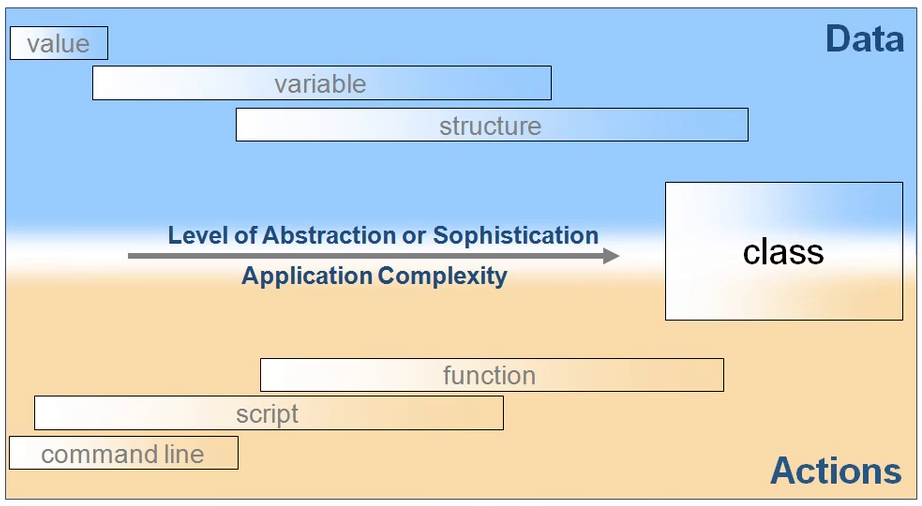

## Objects and classes  

So far in the notes, we have seen the evolution of programming from simple variable definitions and tasks on the Python command line to writing scripts and functions, while passing scalar or compound variables (lists, arrays, dictionaries, ...) to functions. It took a few decades since the development of the first high-level programming language, [Fortran](https://en.wikipedia.org/wiki/Fortran), for the computer scientists to realize that one could take the programming paradigms to an even higher level of combining functions and their input/output data into a single entity called [object](https://en.wikipedia.org/wiki/Object_(computer_science)). Let have another look at the diagram we saw before about the evolution of computer programming paradigms,  

<figure>
    
</figure> 

But there is more to Object-Oriented Programming (OOP) than the simple concept of objects. As soon as we are talking about objects, one has to also specify the **class** to which the object belongs. For example, all dogs in the world belong to the generic class of dog. Similarly, in computer programming, including Python, one has to first define a class from which objects can be **instantiated** whenever needed in the program.  

The concept of Python class, as in almost any other programming language, relates to packing **a set of variables** together **with a set of functions** operating on those variables. The goal of writing classes is to achieve more modular code by grouping data and functions into manageable units. One thing to keep in mind for scientific computing is that classes, and more generally, [Object Oriented Programming (OOP)](https://en.wikipedia.org/wiki/Object-oriented_programming), are not necessary, and could be a hindrance to efficient computing if used naively. Nevertheless, classes lead to either more elegant solutions to the programming problem or a code that is easier to extend and maintain large scale projects. In the non-mathematical programming world where there are no mathematical concepts and associated algorithms to help structure the programming problem, software development can be very challenging. In those cases, Classes greatly improve the understanding of the problem and simplify the modeling of data. As a consequence, almost all large-scale software systems being developed in the world today are heavily based on classes (but certainly not all scientific projects!).  

One of the greatest advantages that the OOP brings to programming is [**code-reusability**](https://en.wikipedia.org/wiki/Code_reuse); Once we define a blueprint class, all objects belonging to that class can be easily instantiated from it and personalized. Therefore, **the first step** in OOP is to define the class of an object that we want to create and use.  

## Defining classes in Python  

Programming with classes is offered by most modern programming languages, including Python. Python uses the concept of classes in almost every bit of it. However, most Python users don't even notice the heavy dependence of Python on classes under the hood, until they learn what a class is, just as we have made progress in this class so far, without knowing about classes.  

In Python, defining a class is as simple as the following syntax,  

```python
class Dog:
    pass
```

The above code creates a class `Dog` that does not have any **attributes** (variables that define different aspects of the object) or **methods** or **functions** (components of objects that define the tasks the object can do with or without the use of the object's attributes). The Python keyword `class` declares the beginning of a class definition, and the `pass` statement is a null operation, meaning that when it is executed, nothing happens. It is simply a placeholder when a statement is required syntactically, but no code needs to be executed.  

Once the class is created, you could instantiate objects from the blueprint class,  

```python
my_dog = Dog()
```

where, the empty parentheses *must be added* in recognition of the fact that Dog is a class, and not an attribute (variable), for example.  

> If you do not add `()` after the class name at the time of object instantiation, then you will simply create a copy of the class blueprint, and not an instance of the class.

For example,  

```python
my_dog = Dog
type(my_dog)
```
    type

You can confirm whether you have indeed instantiated an object from the class `Dog` via `type()` or `isinstance()` intrinsic functions in Python,  

```python
my_dog = Dog()
type(my_dog)
```
    __main__.Dog

```python
my_dog = Dog()
type(my_dog) is Dog
```
    True

```python
my_dog = Dog()
isinstance(my_dog, Dog)
```
    True

or try the intrinsic attribute that comes automatically with all Python objects, containing the class name to which the object belongs,  

```python
my_dog = Dog()
my_dog.__class__
```
    __main__.Dog

## Class attributes vs. instance attributes  

The class `Dog` defined above has no use as it does not contain any attributes or methods. In practice, a dog has color, race, age, and so many other attributes. Besides, it can eat, run, sleep, bark, and so on.  Therefore,  

```python
class Dog:
    # attributes
    age = 0
    name = 'unnamed'
    race = 'unknown'
    color = 'unknown'
```

Now, note that all attributes defined this way must be preassigned a **default value**. However, once an object is instantiated from this class, one could change the default values to anything else. For example,  

```python
my_dog = Dog()
print( "{} is a {}-color {}-race dog of age {}.".format( my_dog.name, my_dog.color, my_dog.race, my_dog.age) )
```
    unnamed is a unknown-color unknown-race dog of age 0.

can be modified to,  

```python
my_dog.age = 3
my_dog.name = "Coco"
my_dog.race = "Terrier"
my_dog.color = "brown"
print( "{} is a {}-color {}-race dog of age {}.".format( my_dog.name, my_dog.color, my_dog.race, my_dog.age) )
```
    Coco is a brown-color Terrier dog of age 3.

### Object constructor  

While the above approach to class attribute definition and value assignment works fine, it is verbose and rather tedious. Instead, there is a better way of initializing an instance of a class by defining an object constructor method within the class definition.  There is an intrinsic method with the specific name `__init__` provided by Python, which can be defined in every class and used for performing tasks that are supposed to be done once (and only once) at the time of object instantiation. This includes the assignment of user-provided values to the attributes or default values in case no value is provided by the user.  

```python
class Dog:
    def __init__(self, age, name, race, color):
        self.age = age
        self.name = name
        self.race = race
        self.color = color
```

```python
my_dog = Dog(3,'Coco','Terrier','brown')
print( "{} is a {}-color {}-race dog of age {}.".format( my_dog.name, my_dog.color, my_dog.race, my_dog.age) )
```
    Coco is a brown-color Terrier-race dog of age 3.

In OOP terminology, this intrinsic class method is called the object **contructor method**. By convention, the **first input argument** to the constructor `__init__` is **always** the object itself, that is going to be instantiated, and is frequently named `self`. However, its name is arbitrary and can be set to anything, for example, `obj` standing for object,  

```python
class Dog:
    def __init__(obj, age, name, race, color):
        obj.age = age
        obj.name = name
        obj.race = race
        obj.color = color
```

```python
my_dog = Dog(3,'Coco','Terrier','brown')
print( "{} is a {}-color {}-race dog of age {}.".format( my_dog.name, my_dog.color, my_dog.race, my_dog.age) )
```

I highly recommend you to stick to the common-practice in object naming or choose a self-explanatory name. Also, note that the constructor is called automatically at the time of object instantiation and one should not call `__init__` explicitly.  

```python
class Dog:
    def __init__(obj, age, name, race, color):
        # instance attributes
        obj.age = age
        obj.name = name
        obj.race = race
        obj.color = color
```

Keep in mind that a class is just a blueprint for defining the Dog, and not for creating an instance of a dog with specific attributes. Therefore, always use class constructors in your class definitions to assign user-specified values to the class attributes at the time of object instantiation instead of setting the attributes to default values in the class.

As a result, the best practice is to **initialize attributes that are common to all instances of a class outside the constructor and keep instance-specific attributes initialization within the class constructor**,  

```python
class Dog:
    
    # class attributes
    species = 'mammal'

    def __init__(obj, age, name, race, color):

        # instance attributes
        obj.age = age
        obj.name = name
        obj.race = race
        obj.color = color
```

### Default values for the instance-attributes in the constructor  

Just as we can create optional arguments for functions, so can we create optional arguments to constructors in Python by setting default values for the optional constructor arguments. For example,  

```python
class Dog:
    
    # class attributes
    species = 'mammal'

    def __init__(obj, age, name='unknown', race='unknown', color='unknown'):

        # instance attributes
        obj.age = age
        obj.name = name
        obj.race = race
        obj.color = color
```

```python
my_dog = Dog(3)
print( "{} is a {}-color {}-race dog of age {}.".format( my_dog.name, my_dog.color, my_dog.race, my_dog.age) )
```
    unknown is a unknown-color unknown-race dog of age 3.

```python
my_dog = Dog(3, name='Coco')
print( "{} is a {}-color {}-race dog of age {}.".format( my_dog.name, my_dog.color, my_dog.race, my_dog.age) )
```
    Coco is a unknown-color unknown-race dog of age 3.

### Summary  

**Class attributes** are the attributes that apply to all instances of the class, and so by convention, are defined outside the object-constructor method of the class.  

**Instance attributes** are the attributes that are unique to each instance of the class and are, therefore, by convention, defined only inside the object-constructor method of the class.  
