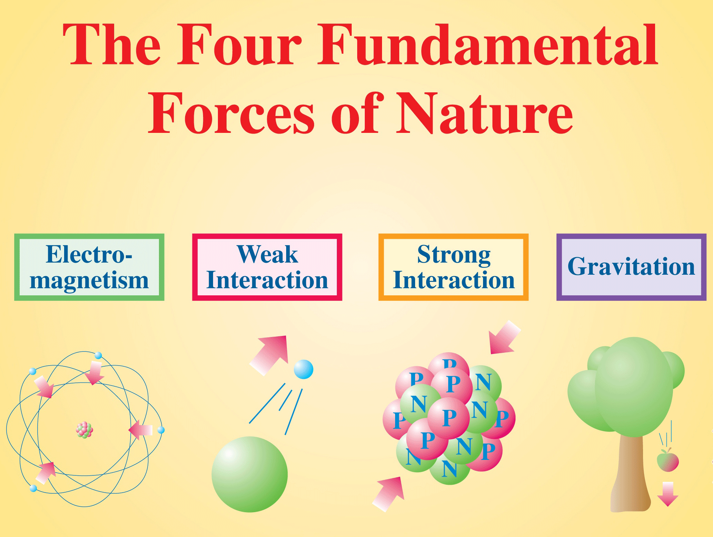
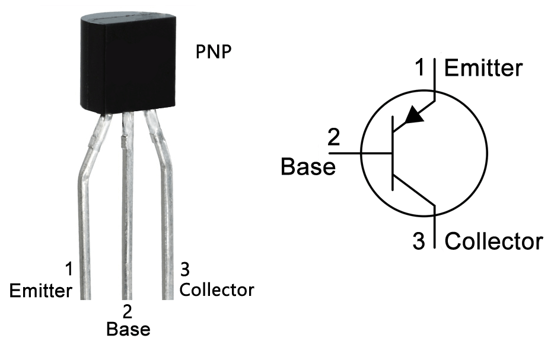
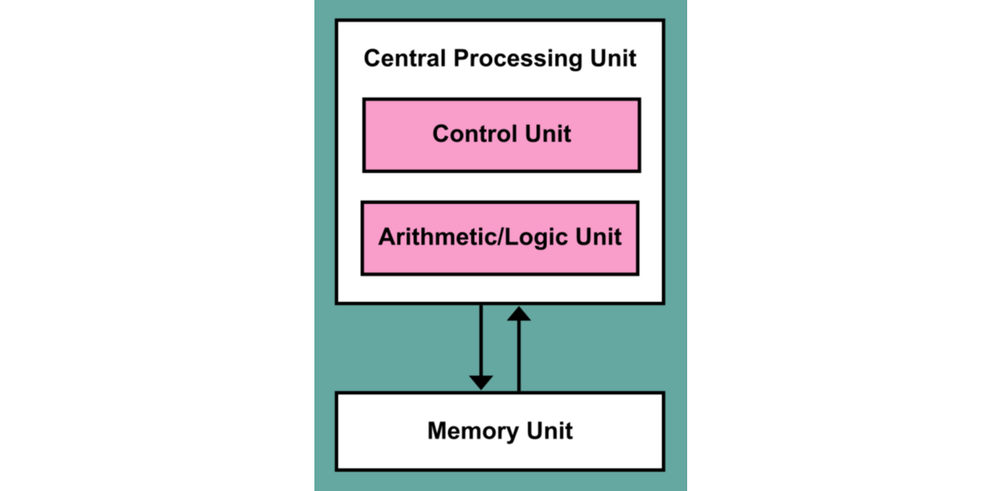
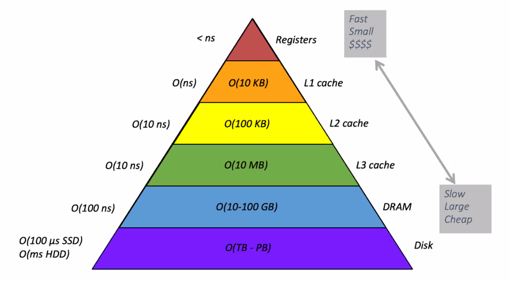

## The four fundamental forces of Nature  

The contemporary Physics recognizes [four fundamental types of forces in Nature](https://en.wikipedia.org/wiki/Fundamental_interaction#The_interactions). Of these four, we only experience the presence of two in our daily lives: The force of gravity (why does everything falls toward Earth? Why does Earth rotate Sun?) and **the Electromagnetic force**. The latter is responsible for almost any kind of force that we experience in our daily lives besides gravity. For example, lightening, the fact that we can walk, the heart beat, all chemical reactions, the computers, everything that we know relies on the presence of the electromagnetic force.  

Computers are not an exception to the electromagnetic force. The flow of electricity in computer hardware is what makes them work and capable of processing and storing data.  

<figure>
    
    <figcaption style="text-align:center">
        The four forces of Nature. Of these four, only two (gravity and electromagnetism) play a major noticeable role in our daily lives. Computer hardware rely on the force of electromagnetism to store and process data. Specifically, they use electric voltage and flow or lack of electricity flow to store and process data as a sequence of 0 and 1.
    </figcaption>
</figure>

## How does a computer process and store data?  

Computer hardware rely on the force of electromagnetism to store and process data. Specifically, they use electric voltage and electricity flow or the lack of flow to store and process data as a sequence of 0 and 1. The fundamental building block of a modern conventional computer central processor unit (CPU) is transistor. Transistors were invented in the early 1950' and are switches that can control or amplify an electric current. The inner workings of a transistor is displayed in the figure below.  

<figure>
    
    <figcaption style="text-align:center">
        A schematic illustration of a PNP transistor.
    </figcaption>
</figure>

Each transistor has three components:  

+   **Base**: The base is responsible for controlling whether current is allowed to flow through the transistor when power is applied.  
+   **Collector**: When there is power to the base, the collector current is allowed to flow towards the emitter.  
+   **Emitter**: The emitter takes the electric current that the collector is allowed to send, to be used on other parts of your circuit.  

Combinations of transistors can build the electronic equivalents of the logical operators that we discussed in DATA 1301: Introduction to Data Science, for example: AND, OR, NAND, NOR, XOR, XNOR. Then, the combinations of these logical operators can becomes equivalents to addition, subtraction, multiplication, and other more complex operations.

## The modern computer architecture   

In the early days of computers, around and before 1950, computers were mostly **fixed-program computers**, a kind of computer that had to be *rewired* to perform a new task. Even nowadays, we still have these kinds of computers around us, like calculators. But soon, scientists and engineers realized that this method of computer programming was too tedious and complex. So, many independently proposed and devised alternative computer architectures that stored the tasks as data in a memory, instead of having to be rewired for the new task. The computer would then read the program (the set of instructions to perform) from the memory and execute the instructions. One such architecture that has become popular and remained to this date is the **Von Neumann Architecture** proposed by the famous scientist [John Von Neumann](https://en.wikipedia.org/wiki/John_von_Neumann).  

<figure>
    
    <figcaption style="text-align:center">
        The major compartments of a CPU.
    </figcaption>
</figure>

The Von Neumann computer architecture, displayed in the above figure, has the following major components:  
+   **Memory array** (MEM) holds all the **commands** (instructions) and **numbers** (data).  
+   **Control Unit**:
    +   **Program counter** selects which instruction to execute from MEM. It normally just increases by 1 in each step.  
+   **Arithmetic block** is responsible for performing arithmetic operations (+, -, ...) on the input data (comprised of binary 0 and 1).  The input/output of the arithmetic block are held in a special part of computer memory called **CPU registers**.  

The instructions that the CPU has to execute are typically of two types: **data instructions** and **control instructions**. Each data instruction contains four parts:  
+   two addresses specifying which two numbers to pick from the memory (MEM).  
+   one command that specifies what operation to perform.  
+   the memory location to store the result of the operation.  

## The computer memory hierarchy  

Modern computer architectures typically do not have a single homogeneous chunk of memory available to the processor. Rather, the memory is laid out in a hierarchical structure as shown in the figure below.  

<figure>
    
    <figcaption style="text-align:center">
        The memory hierarchy of modern computers.
    </figcaption>
</figure>

In this hierarchy, as we move to the tip of the pyramid, closer to the processor, the memory access speed increases. However, the memory size also shrinks. There is therefore, a compromise between memory access speed and memory size.  
