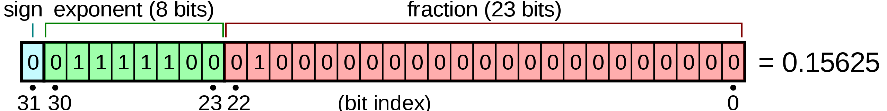

<a name="glossary"></a>
## Programming glossary
The following table contains some technical programming phrases that are often used and heard in the field of computer science and programming, that you need to be familiar as well.  

<table class="center">
    <caption class="title" style="padding-bottom:10px;text-align:center;">
        Table 1. Some programming phrases that are discussed in this lecture. The boldface words in the description column indicate items that are expressions with their own description in this table.
    </caption>
    <thead>
        <tr>
            <th>Expression</th>
            <th>Description</th>
        </tr>
    </thead>
    <tbody>
        <tr><td><b>algorithm</b></td><td>A general method for solving a class of problems.</td></tr>
        <tr><td><b>bug</b></td><td>An error in <b>program</b> that has to be resolved for successful execution of the program.</td></tr>
        <tr><td><b>compiled language</b></td><td>A programming language whose programs need to be compiled by a <b>compiler</b> in order to run.</td></tr>
        <tr><td><b>compiler</b></td><td>A software that translates an entire high-level program into a lower-level language to make it <b>executable</b>.</td></tr>
        <tr><td><b>debugging</b></td><td>The process of finding and removing any type of error in the program.</td></tr>
        <tr><td><b>exception</b></td><td>An alternative name for <b>runtime error</b> in the program.</td></tr>
        <tr><td><b>executable</b></td><td>An <b>object code</b>, ready to be executed. Generally has the file extension <code>.exe</code> or <code>.out</code> or no extension at all.</td></tr>
        <tr><td><b>formal language</b></td><td>A language that is intentionally designed for specific purposes, which, unlike <b>natural languages</b>, follows a strict standard.</td></tr>
        <tr><td><b>high-level language</b></td><td>A programming language (e.g., Python, Fortran, Java, etc) that has high level of abstraction from the underlying hardware.</td></tr>
        <tr><td><b>interpreted language</b></td><td>A programming language whose statements are interpreted line-by-line by an <b>interpreter</b> and immediately executed.</td></tr>
        <tr><td><b>low-level language</b></td><td>A programming language that has a low-level of abstraction from computer hardware and architecture, such as Assembly. Very close to machine code.</td></tr>
        <tr><td><b>natural language</b></td><td>A language that evolves naturally, and has looser <b>syntax</b> rules and standard compared to <b>formal languages</b>.</td></tr>
        <tr><td><b>object code</b></td><td>The output of a compiler after translating a program.</td></tr>
        <tr><td><b>parsing</b></td><td>Reading and examining a file/program and analyzing the syntactic structure of the file/program.</td></tr>
        <tr><td><b>portability</b></td><td>A program's ability to be exucatable on more than one kind of computer architecture, without changing the code.</td></tr>
        <tr><td><b>problem solving</b></td><td>The process of formulating a problem and finding and expressing a solution to it.</td></tr>
        <tr><td><b>program</b></td><td>A set of instructions in a that together specify an algorithm a computation.</td></tr>
        <tr><td><b>runtime error</b></td><td>An error that does not arise and cause the program to stop, until the program has started to execute.</td></tr>
        <tr><td><b>script</b></td><td>A program in an <b>interpreted language</b> stored in a file.</td></tr>
        <tr><td><b>semantic error</b></td><td>A type of error in a program that makes the program do something other than what was intended. Catching these errors can be very tricky.</td></tr>
        <tr><td><b>semantics</b></td><td>The meaning of a program.</td></tr>
        <tr><td><b>source code</b></td><td>A program in a high-level compiled language, before being compiled by the <b>compiler</b>.</td></tr>
        <tr><td><b>syntax error</b></td><td>A type of error in program that violates the standard <b>syntax</b> of the programming language, and hence, the program cannot be interpreted or compiled until the syntax error is resolved.</td></tr>
        <tr><td><b>syntax</b></td><td>The structure of a program.</td></tr>
        <tr><td><b>token</b></td><td>One of the basic elements of the syntactic structure of a program, in analogy with <i>word</i> in a <b>natural language</b>.</td></tr>
        <tr><td><b>dictionary</b></td><td>A collection of `key:value` mapping pairs, in which the values can be obtained by calling the value's key.</td></tr>
        <tr><td><b>hashable</b></td><td>A Python object (e.g., variable) that has a <a href="https://en.wikipedia.org/wiki/Hash_function" target="_blank">hash value</a> which never changes during its lifetime.</td></tr>
        <tr><td><b>immutable</b></td><td>A variable or value that cannot be modified. Assignments to elements of immutable values cause a runtime error. Example immutable Python entities are tuples and strings.</td></tr>
        <tr><td><b>invocation</b></td><td>The process of calling an object's method, usually done through <code>&#60;object name&#62;.&#60;method name&#62;</code> notation.</td></tr>
        <tr><td><b>list</b></td><td>A sequence of comma-separated heterogenous values next to each other.</td></tr>
        <tr><td><b>method</b></td><td>Similar to a function, a method is a predefined built-in Python script that performs a specific task on the data object to which the method belongs.</td></tr>
        <tr><td><b>mutable</b></td><td>A variable or value that can be modified. Examples of mutables in Python are lists, and dictionaries.</td></tr>
        <tr><td><b>set</b></td><td>An unordered collection of unique elements, just like the mathemtical sets.</td></tr>
        <tr><td><b>string</b></td><td>A sequence of characters next to each other.</td></tr>
        <tr><td><b>tuple</b></td><td>An immutable data value that contains related elements. Tuples are used to group together related data, such as a person’s name, their age, and their gender.</td></tr>
    </tbody>
</table>

## The binary representation of data and instructions  

In the early days of computing, around 1950', there was no consensus on how data, in particular, numbers should be represented in the computer hardware. But as time went by, the entire community has converged to representing all data and numerics in binary in computers. The advantage and simplicity of using binary 0 and 1 to represent data may be obvious; 0 and 1 are easy to represent electronically. For example, the flow of the lack of flow of electric current could be used to represent 0 and 1. Alternatively, the presence or lack of a charge or magnetism in a particular location in the memory could be used to represent 0 and 1. Therefore, anything that can be represented as a binary number can be also stored in computer memory and processed.  

The tiniest unit of information in computer and information science is a **bit**. A bit of information can either represent 0 or 1. Of particular significance is the binary representation of real numbers. Modern computer architectures use 64-bits of information to store real numbers. But a problem immediately arises with the representation of real numbers in computers. **A 64-bits amount of information can represent only a limited set of real numbers. There are, however, an uncountably infinite number of real numbers.** Therefore, rules have been laid out by major computing organizations such as IEEE that specify what real numbers and how they can be represented as binary numbers in a computer.  

<figure>
    
    <figcaption style="text-align:center">
        The 64-bit binary representation model of real numbers in modern computers.
    </figcaption>
</figure>

The above figure shows the typical representation of a real number in binary in a computer. As seen, each real number is represented by its significant digits (23-bits) and its exponent (8-bits) and its sign (which is represented by only one bit of information). It is obvious from this illustration that not all real numbers could be represented by 23-bits for significant digits.

One could use more than 64 bits to represent real numbers more precisely. However, the higher the number of bits, the more demanding the computations and the storage of the numbers will become. As such, most contemporary computers and computer programming languages only enable the default real number representation by 64-bits and some (like Fortran, C, C++, Python) also provide 128-bit real number representation for very large or highly accurate real number representations.  

<figure>
    
    <figcaption style="text-align:center">
        The set of real numbers on the real axis that could be represented via the 64-bit binary representation in modern computers.
    </figcaption>
</figure>

## The contents of a computer program  

Although different programming languages look different in their syntax standards, virtually all programming languages are comprised of the following major compnents (instructions):  
<br>
1. **input**  
  Virtually every program starts with some input data by the user, or the input data that is [hard-coded](https://en.wikipedia.org/wiki/Hard_coding) in the program.  
  <br>
2. **mathematical/logical operations**  
  Virtually all programs involve some sort of mathematical or logical operations on the input data to the program.  
  <br>
3. **conditional execution**  
  In order to perform the above operations on data, most often (but not always) there is a need to check if some conditions are met in the program, and then perform specific programming instructions corresponding to each of the conditions.  
  <br>
4. **repetition / looping**  
  Frequently it is needed to perform a specific set of operations repeatedly in the program to achieve the program's goal.  
  <br>
5. **output**  
  At the end of the program, it is always needed to output the program result, either to a computer screen or to a file.  

## Debugging a program  

As it is obvious from its name, a **bug** in a computer program is annoying programming error that needs fixing in order for the program to become executable **or** to give out the correct answer. The process of removing program bugs is called debugging. There are basically three types of programming bugs (errors):  

### Syntax error  
<br>
A program, whether interpreted or compiled, can be successfully run only if it is *syntactically correct*. Syntax errors are related to the structure and standard of the language, and the order by which the language **tokens** are allowed to appear in the code. For example, the following Python `print` statement is a syntax error in Python 3 standard, whereas it was considered to be the correct syntax for `print` in Python 2 standard.  
<br>
```python
print 'Hello World!'
```
      File "<ipython-input-21-10fdc521e430>", line 1
        print 'Hello World!'
                           ^
    SyntaxError: Missing parentheses in call to 'print'

The syntactically-correct usage of `print` in Python 3 would be,  

```python
print ('Hello World!')  
```
    Hello World!

### Runtime error  

Runtime errors or sometimes also named **exceptions** are a class of programming errors that can be detected only at the time of running the code, that is, they are not syntax errors. Examples include:  
  - memory leaks (very common error in beginner C and C++ codes)
  - uninitialized memory
  - access request to an illegal memory address of the computer
  - security attack vulnerabilities
  - buffer overflow

These errors can be sometimes tricky to identify.  

### Semantic error  

Unlike syntax errors that comprise of something the compiler/interpreter does not understand, semantic errors do not cause any compiler/interpreter error messages. However, the resulting compiled/interpreted code will NOT do what it is intended to do. Semantic errors are the most dangerous types of programming errors, as they do not raise any error flag by the compiler/interpreter, yet the program will not do what it is intended to do, although the code may look perfectly fine on its face. A semantic error is almost synonymous with **logical error**. Dividing two integers using the regular division operator `/` in Python 2 and expecting the result to be real, would result in a semantic error. This is because, in Python 2 standard, the regular division operator is equivalent to **integer division** for integer operands:  

In Python 2,  

```python
2/7
```
    0

Whereas, you might have really meant a **float division** by using `/`, as in Python 3,  

```python
2/7
```
    0.2857142857142857
