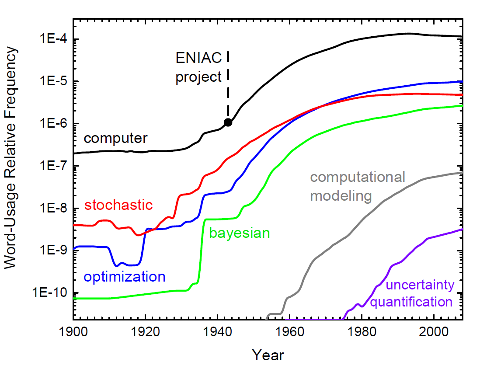
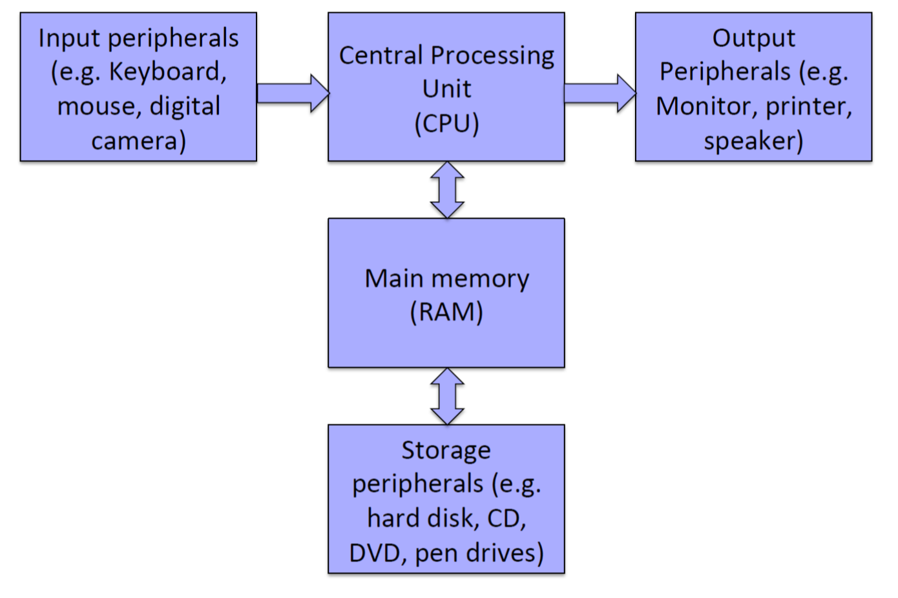
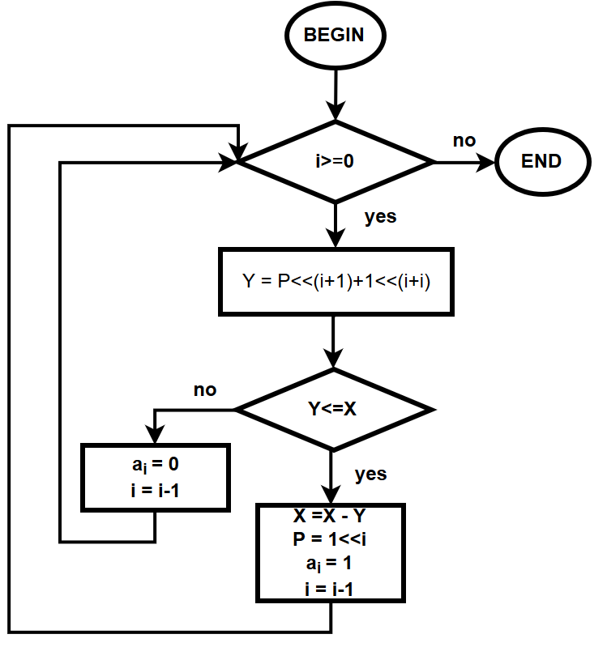
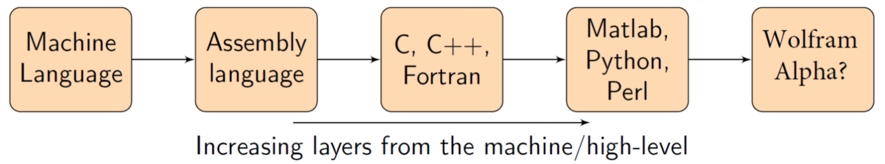
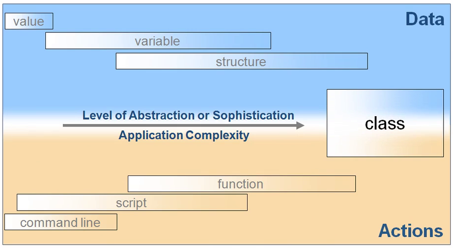
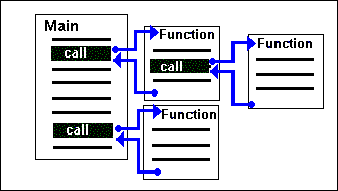
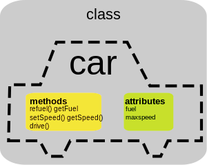
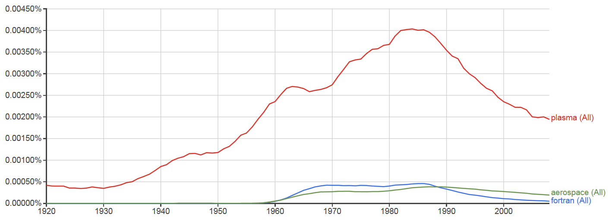
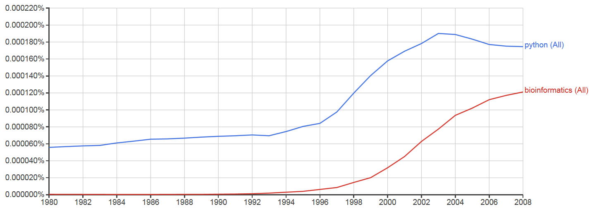
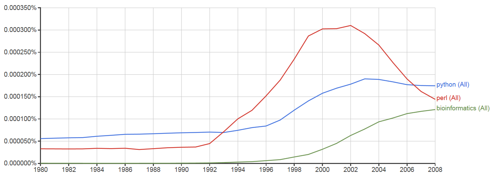

## Programming glossary

The following table contains some technical programming phrases that are often used and heard in the field of computer science and programming, that you need to be familiar with as well.  

<table class="center">
    <caption class="title" style="padding-bottom:10px;text-align:center;">
        Table 1. Basic common programming phrases and keywords that are discussed in this note. The boldface words in the description column indicate keywords that have their own descriptions provided in this table.
    </caption>
    <thead>
        <tr>
            <!--
            <th>Expression</th>
            <th>Description</th>
            -->
            <th>Expression</th><th>Description</th>
        </tr>
    </thead>
    <tbody>
        <tr>
            <td><b>algorithm</b></td>
            <td>A general method for solving a class of problems.</td>
        </tr>
        <tr>
            <td><b>bug</b></td>
            <td>An error in <b>program</b> that has to be resolved for successful execution of the program.</td>
        </tr>
        <tr>
            <td><b>compiled language</b></td>
            <td>A programming language whose programs need to be compiled by a <b>compiler</b> in order to run.</td>
        </tr>
        <tr>
            <td><b>compiler</b></td>
            <td>A software that translates an entire high-level program into a lower-level language to make it <b>executable</b>.</td>
        </tr>
        <tr>
            <td><b>debugging</b></td>
            <td>The process of finding and removing any type of error in the program.</td>
        </tr>
        <tr>
            <td><b>exception</b></td>
            <td>An alternative name for <b>runtime error</b> in the program.</td>
        </tr>
        <tr>
            <td><b>executable</b></td>
            <td>An <b>object code</b>, ready to be executed. Generally has the file extension <code>.exe</code> or <code>.out</code> or no extension at all.</td>
        </tr>
        <tr>
            <td><b>formal language</b></td>
            <td>A language that is intentionally designed for specific purposes, which, unlike <b>natural languages</b>, follows a strict standard.</td>
        </tr>
        <tr>
            <td><b>high-level language</b></td>
            <td>A programming language (e.g., MATLAB, Python, Fortran, Java, etc) that has high level of abstraction from the underlying hardware.</td>
        </tr>
        <tr>
            <td><b>interpreted language</b></td>
            <td>A programming language whose statements are interpreted line-by-line by an <b>interpreter</b> and immediately executed.</td>
        </tr>
        <tr>
            <td><b>low-level language</b></td>
            <td>A programming language that has a low-level of abstraction from computer hardware and architecture, such as Assembly. Very close to machine code.</td>
        </tr>
        <tr>
            <td><b>natural language</b></td>
            <td>A language that evolves naturally, and has looser <b>syntax</b> rules and standard compared to <b>formal languages</b>.</td>
        </tr>
        <tr>
            <td><b>object code</b></td>
            <td>The output of a compiler after translating a program.</td>
        </tr>
        <tr>
            <td><b>parsing</b></td>
            <td>Reading and examining a file/program and analyzing the syntactic structure of the file/program.</td>
        </tr>
        <tr>
            <td><b>portability</b></td>
            <td>A program's ability to be executable on more than one kind of computer architecture, without changing the code.</td>
        </tr>
        <tr>
            <td><b>problem solving</b></td>
            <td>The process of formulating a problem and finding and expressing a solution to it.</td>
        </tr>
        <tr>
            <td><b>program</b></td>
            <td>A set of instructions in a that together specify an algorithm a computation.</td>
        </tr>
        <tr>
            <td><b>runtime error</b></td>
            <td>An error that does not arise and cause the program to stop, until the program has started to execute.</td>
        </tr>
        <tr>
            <td><b>script</b></td>
            <td>A program in an <b>interpreted language</b> stored in a file.</td>
        </tr>
        <tr>
            <td><b>semantic error</b></td>
            <td>A type of error in a program that makes the program do something other than what was intended. Catching these errors can be very tricky.</td>
        </tr>
        <tr>
            <td><b>semantics</b></td>
            <td>The meaning of a program.</td>
        </tr>
        <tr>
            <td><b>source code</b></td>
            <td>A program in a high-level compiled language, before being compiled by the <b>compiler</b>.</td>
        </tr>
        <tr>
            <td><b>syntax error</b></td>
            <td>A type of error in program that violates the standard <b>syntax</b> of the programming language, and hence, the program cannot be interpreted or compiled until the syntax error is resolved.</td>
        </tr>
        <tr>
            <td><b>syntax</b></td>
            <td>The structure of a program.</td>
        </tr>
        <tr>
            <td><b>token</b></td>
            <td>One of the basic elements of the syntactic structure of a program, in analogy with <i>word</i> in a <b>natural language</b>.</td>
        </tr>
    </tbody>
</table>

 

### The rise of the machines  

Immediately after the first world war and during the second world war, many fields of science and engineering witnessed rapid growth. In particular, two fields of mathematical and physical sciences, **mathematical programming** (a terminology used commonly in place of [mathematical optimization](https://en.wikipedia.org/wiki/Mathematical_optimization)) (not to be confused with computer programming!) and [Monte Carlo methods](https://en.wikipedia.org/wiki/Monte_Carlo_method) witnessed rapid exponential growth in both theory and practical applications. Parallel to the progress in natural sciences, a new field of science and technology, [computer science](https://en.wikipedia.org/wiki/History_of_computer_science), began to rise during the years of world-war-II, partly in response to the needs of war, but mostly in response to the exponential growth of natural sciences and engineering in the post-world-war-II era.

<figure>
    
    <figcaption style="text-align:justify">
        A word-usage relative frequency plot, illustrating the exponential growth of computer technology in the mid 20th century, as well as developments in the fields of deterministic and stochastic optimization techniques, which ultimately led to the emergence of <a href="https://www.nibib.nih.gov/science-education/science-topics/computational-modeling" target="_blank">computational modeling</a> as the third pillar of science. Advances in the computational methods and technology also led to the gradual popularity of Bayesian techniques in mathematical modeling toward the end of the 20th century, and the emergence of an important subfield of computational modeling, now known as <a href="https://en.wikipedia.org/wiki/Uncertainty_quantification" target="_blank">Uncertainty Quantification</a>. Note that the positive-slope linear behavior on this semi-logarithmic plot indicates exponential growth.
    </figcaption>
</figure>

The history of computer programming probably begins with the development of the first computer, [ENIAC](https://en.wikipedia.org/wiki/ENIAC) (*Electronic Numerical Integrator And Computer*), one of the earliest electronic general-purpose computers made. 

<figure>
    
    <figcaption style="text-align:justify">
        A diagram representing the basic underlying structure of every digital device, most importantly, desktop computers.
    </figcaption>
</figure>

## How to express algorithms in machine language?  

To answer this question, we have to first understand that **all human knowledge can be divided into two classes**:  

+   declarative, and  
+   imperative (procedural).  

As implied by its name, **declarative knowledge** involves **statements of fact**. For example,  

+   J is the tenth letter of the alphabet, or,  
+   Washington is the capital of the USA, or,  
+   $x$ is square-root of $y$ only and only if $x*x=y$,  
  
are all declarative statements. By contrast, **imperative knowledge** is about **how to accomplish something**, or basically, is **a recipe on how to do something**, known as [algorithm](https://en.wikipedia.org/wiki/Algorithm) in scientific terminology. In order for a computer to achieve a specific computational goal, it needs to be given a set of tasks, collectively called an **algorithm**. For example, most calculators contain a rather complex [algorithm for calculating the square root of a given input number](https://www.sistenix.com/sqrt.html), like the following,

<figure>
    
</figure>
 

As seen, the algorithm has a **start**, a **flow control**, and a **stop**. These are the basic elements of an algorithm. In the early 20th century, the algorithms had to be physically and mechanically implemented in computers. Therefore, the earliest computing machines were often called **fixed-program computers**. This means that they could only perform the algorithms for which they had been physically wired and built. An example of such machines is [ENIAC](https://en.wikipedia.org/wiki/ENIAC). **Reprogramming** such computers, when possible at all, is a laborious process, starting with flowcharts and paper notes, followed by detailed engineering designs, and then the often-arduous process of physically rewiring and rebuilding the machine. For example, it could take almost a month to set up a program on ENIAC and get it working.

<figure>
    
    <figcaption style="text-align:justify">
        Portraits of three of the many giants involved in building and using the first US-made digital computer ENIAC and the first computer simulations in human history.  
    </figcaption>
</figure>

Even nowadays, some very simple computers still use this design, either for simplicity or training purposes. For example, a desk calculator (in principle) is a fixed program computer. It can do basic mathematics, but it cannot be used as a word processor or a gaming console. Changing the program of a fixed-program machine requires rewiring, restructuring, or redesigning the machine. The earliest computers were not so much "programmed" as they were "designed". 

It took a while until the early computer scientists noticed that they could design computers in such a way that the algorithm itself could be treated as part of the input data to the computer. In other words, one could build a [general-purpose machine](https://en.wikipedia.org/wiki/Turing_machine), that could take any computer algorithm as input and given its own basic set of operations (basically, if-conditional, goto, and memory access) could run the algorithm. Such machines, which are nowadays in everyday use, are called **stored-program computers**.

## Programming language generations

Initially computers had to be programmed by what is called [machine code](https://en.wikipedia.org/wiki/Machine_code) or [machine language](https://en.wikipedia.org/wiki/Machine_code), a set of instructions for the Central Processing Unit (CPU)  of the computer, comprising a long sequence of binary digital zeros and ones. Any interaction with computer hardware, even nowadays, has to be first converted to machine code to become comprehensible by the computer hardware. The coding in this language is, however, very tedious and time-consuming, and non-portable. Consequently, immediately after the development of the first generation of computers, the first generation of programming languages also came to existence, most notably, the [Assembly language](https://en.wikipedia.org/wiki/Assembly_language) in the late 1940s, also known as **symbolic machine code**. Many more programming languages have been since developed that provide higher and higher levels of [programming abstraction](https://en.wikipedia.org/wiki/Abstraction_(software_engineering)) by hiding more complexities of the machine code interaction with machine hardware from the front-end computer software and users.

<figure>
    <!--
    <figcaption style="text-align:center">
        A flowchart illustrating .
    </figcaption>-->
</figure>
 

Depending on their levels of abstraction, programming languages are classified into different generations:

- **First generation:** The [First generation](https://en.wikipedia.org/wiki/First-generation_programming_language) languages, or machine languages, are the lowest-level computer programming languages, which provide no abstraction in their interactions with computer hardware. These languages directly interact with computer hardware, and so there is no need for a [compiler](https://en.wikipedia.org/wiki/Compiler) or [assembler](https://en.wikipedia.org/wiki/Assembly_language#Assembler) to interpret these languages for the hardware.
- **Second generation:** The [second generation](https://en.wikipedia.org/wiki/Second-generation_programming_language) languages, are at a higher level of abstraction from the machine hardware, meaning that they require an [assembler](https://en.wikipedia.org/wiki/Assembly_language#Assembler) to interpret the code for the computer hardware. The most prominent and, to my understanding, the sole language of this generation is [Assembly](https://en.wikipedia.org/wiki/Assembly_language), which is the closest-possible compiled programming language to computer hardware.
- **Third generation:** The [third generation](https://en.wikipedia.org/wiki/Third-generation_programming_language) languages, or [high-level](https://en.wikipedia.org/wiki/High-level_programming_language) programming languages provide an even higher abstraction level than the second-generation languages. Third-generation languages make programming almost platform-independent, meaning that the content of the code does not depend directly on the current hardware being used. This helps the programmer to focus more on the problem of interest, rather than spending time to understand details of the specific computer and hardware being currently used. Examples of third-generation programming languages are: [Fortran](https://en.wikipedia.org/wiki/Fortran), [ALGOL](https://en.wikipedia.org/wiki/ALGOL), [COBOL](https://en.wikipedia.org/wiki/COBOL), [BASIC](https://en.wikipedia.org/wiki/BASIC), [C](https://en.wikipedia.org/wiki/C_(programming_language)), [C#](https://en.wikipedia.org/wiki/C_Sharp_(programming_language)), [C++](https://en.wikipedia.org/wiki/C%2B%2B), [Java](https://en.wikipedia.org/wiki/Java_(programming_language)), [Pascal](https://en.wikipedia.org/wiki/Pascal_(programming_language))
- **Fourth generation:** The definition for the [fourth generation](https://en.wikipedia.org/wiki/Fourth-generation_programming_language) and beyond is not very clear, however, it is generally as the set of languages that provide an even higher level of abstraction from the hardware and proximity to the user (programmer). Some prominent examples of this category include , [Python](https://en.wikipedia.org/wiki/Python_(programming_language)), [Perl](https://en.wikipedia.org/wiki/Perl), [Ruby](https://en.wikipedia.org/wiki/Ruby_(programming_language)), [IDL](https://en.wikipedia.org/wiki/IDL_(programming_language)), [R](https://en.wikipedia.org/wiki/R_programming_language), [S](https://en.wikipedia.org/wiki/S_(programming_language)).

<figure>
    
    <figcaption style="text-align:center">
        A diagram tracing the history of computer languages throughout the history of computer science.
    </figcaption>
</figure>
 

## Programming language paradigms

Programming paradigms are a way to classify programming languages based on their features. There are several programming paradigms such as,
 
  - [structured programming](https://en.wikipedia.org/wiki/Structured_programming),  
  - [imperative programming](https://en.wikipedia.org/wiki/Imperative_programming) (allows side effects),  
  - [functional programming](https://en.wikipedia.org/wiki/Functional_programming) (disallows side effects),  
  - [procedural programming](https://en.wikipedia.org/wiki/Procedural_programming) (groups code into functions and subroutines),  
  - [object-oriented programming (OOP)](https://en.wikipedia.org/wiki/Object-oriented_programming) (groups code together with the data on which the code works).

<figure>
    
    <figcaption style="text-align:center">
        A schematic representation of the evolution of programming techniques.
    </figcaption>
</figure>

Among all, however, the last two programming paradigms are the most important and more widely used than the others. Historically all programming languages were **imperative (or, procedural)** since this paradigm is more intuitive to the human mind, and indeed, what the computer hardware does. These languages are human-readable abstractions of the machine code.

<figure>
    
    <figcaption style="text-align:center">
        A schematic representation of the structure of imperative (procedural) programming.
    </figcaption>
</figure>

Imperative programs have a structure like in the figure above, with the following components and rules:

  - they must contain a **main procedure** that determines the control flow for the program, and,
  - they must contain a set of functions that are called to perform certain tasks during program execution, and,
  - the main and sub-main procedures have a hierarchical structure, and,
  - the source code for each procedure is compiled, and,
  - all compiled procedures and the main procedure are linked together with other source codes to produce a complete **executable program**.  

A few decades after the first imperative programming languages were developed, computer scientists came up with an alternative programming paradigm that resulted in higher levels of abstraction from the machine code, however, could also significantly reduce the cost of code development and increase the amount of code re-usability, from one program to the next. This programming paradigm is called **object-oriented programming (OOP)**, since it looks at everything in the code, as an **object**. Each object then has a **type**, or, **class**, to which it belongs. For example, one can define a class describing a car in general, which has some **attributes** that specify its model, make, year, owner, ... , as well as some **methods* that can act on these attributes and make the car do something,

<figure>
    <!--
    
    -->
        
    <figcaption style="text-align:center">
        A example of a OOP class describing a car, with its attributes and methods.
    </figcaption>
</figure>
 

## Programming language purpose

Some programming languages have been designed to target a specific market. For example, in the mid 20th century, there were two prominent languages [Fortran](https://en.wikipedia.org/wiki/Fortran) for numerical and scientific computation, and [COBOL](https://en.wikipedia.org/wiki/COBOL) for business problems. In the field of scientific computation, Fortran (FORmula TRANslation), first released in 1956, is undoubtedly the most influential programming language of all human history and the oldest high-level programming language that is still in active everyday use. Among all programming languages, Fortran is the only one that specifically targets scientists and engineers as its audience. Here is a history of Fortran by its original developers:

    

        

            <iframe src="https://www.youtube.com/embed/KohboWwrsXg?rel=0" frameborder="0" allowfullscreen>
            </iframe>
        

    

And there is of course, no doubt about the importance of general-purpose programming language [C](https://en.wikipedia.org/wiki/C_(programming_language)) and its descendant [C++](https://en.wikipedia.org/wiki/C%2B%2B). Specifically, C++ grew out of interest is developing a language that is universal, that is, can be used for any purpose (business, OS development, scientific computation), that could also reduce the cost of code maintenance and software development. In the beginning, C++ codes were rather slow and inefficient, but more recently the language has significantly caught up with the two high-performance computing (HPC) languages C and Fortran. Here is a short video describing the origin of C++ by its own inventor:

    

        

            <iframe src="https://www.youtube.com/embed/JBjjnqG0BP8" frameborder="0" allowfullscreen>
            </iframe>
        

    

 

Both C and C++, as well as Fortran are still widely used every day. These three languages are anonymously present in the lives of virtually all humans every day. For example, all climate and weather prediction software, as of today, rely on HPC kernels that have been written and are still written in Fortran. Similarly, almost every operating system that you use on your electronic devices, has some connection to C or C++.

## A final, personal remark

Sometimes science acts like humans: it finds a matching partner (a programming language), then they flourish together, make a love story and occasionally decline together as well, with the only difference that polygamy is allowed in science, like Fortran's marriage with Aerospace and [Plasma physics](https://en.wikipedia.org/wiki/Plasma_(physics)):

<figure>
    
    <figcaption style="text-align:justify">
        A plot illustrating the co-evolution of two of the most challenging computationally-intensive fields of science (Aerospace and Plasma Physics) with the most popular high-performance scientific programming language in human history as of today. The vertical axis represents the relative word-usage frequency of the three keywords (Plasma, Aerospace, and Fortran) in all digital corpus, and the horizontal axis represents the year. Note that the downward slope of the curves in later times does NOT imply the decline of these fields of science or the decline of Fortran. It merely means that they have reached their exponential peak growth in the mid-1980s, and are now expanding steadily (linearly), whereas other newer fields (such as bioinformatics) are being more and more frequently referenced than the above three keywords every year in all digital corpus.
    </figcaption>
</figure>

Many times throughout recent history, some specific fields of science have boosted and popularized some computer programming languages and vice versa, in a positive feedback loop. A younger just-married couple seems to be Bioinformatics-Python, both of which, as of today seems to be thriving:

<figure>
    
    <figcaption style="text-align:justify">
        A plot illustrating the co-evolution and thriving of the field of bioinformatics with the popular programming language, Python. The vertical axis represents the relative word-usage frequency of the two keywords (Bioinformatics and Python) in all digital corpus, and the horizontal axis represents the year.
    </figcaption>
</figure>

Sometimes, a programming language couples with a specific field of science and thrives for a few years, only to be soon replaced with a younger, more attractive, programming language. This is probably what happened to the co-evolution of Perl with bioinformatics, a language that was gradually replaced with Python at the beginning of the new millennium, at least in the field of bioinformatics.

<figure>
    
    <figcaption style="text-align:justify">
        A plot illustrating the evolution and steady expansion of the Perl programming language and its gradual replacement with Python, in the field of bioinformatics. The vertical axis represents the relative word-usage frequency of the three keywords (Bioinformatics, Python, and Perl) in all digital corpus, and the horizontal axis represents the year.
    </figcaption>
</figure>

Here is an animated timeline of the popularities of different programming languages in the history of computer programming,  

    

        

            <iframe width="560" height="315" src="https://www.youtube.com/embed/44h6SR0zkR8" frameborder="0" allow="accelerometer; autoplay; encrypted-media; gyroscope; picture-in-picture" allowfullscreen></iframe>
            </iframe>
        

    

 

Note that the decline of different languages does not necessarily mean that the language has been abandoned. Some languages are domain-specific, like Fortran for numerical computing, and stop their growth once they reach their maximum user base from the society (which is mostly scientists and engineers). The popularity of the different languages is also a good indicator of the breadth of the applications of languages. For example, JavaScript has had huge demands and popularity in recent years because of the extremely rapid expansion of the World Wide Web.  

