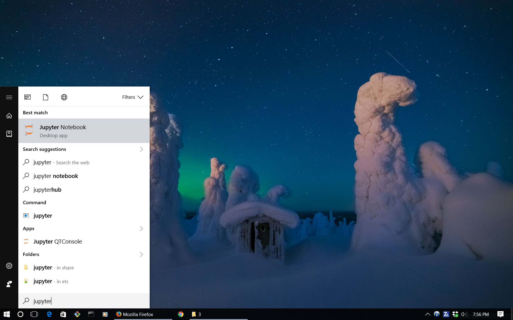
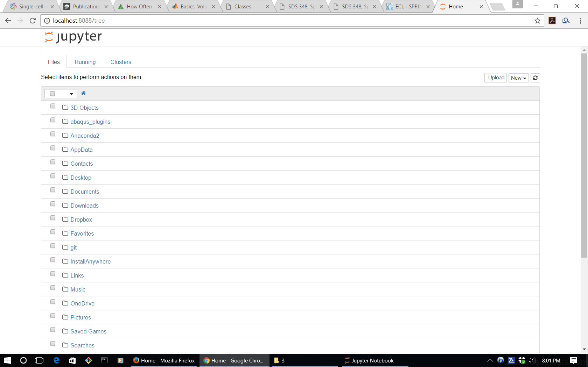
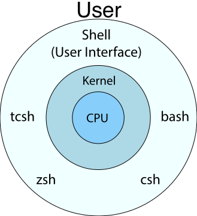

<a name="history"></a>
## Python: a brief history  

Python was developed close to the beginning of the 1990', by [Guido van Rossum](https://en.wikipedia.org/wiki/Guido_van_Rossum), a former employee of [Google](https://en.wikipedia.org/wiki/Google), who is now an employee of [Dropbox](https://en.wikipedia.org/wiki/Dropbox_(service)). The name of the language is attribution to the British sketch comedy [Monty Python's Flying Circus](https://en.wikipedia.org/wiki/Monty_Python%27s_Flying_Circus). As of 2016 Python seems to be the fastest growing language for data science. Python has the following features and attributes.  

- **Python is a fourth-generation, high-level programming language.** A high-level programming language provides a high level of programming abstraction from details of computer and machine code. For comparison, Fortran, C, and C++ are considered high, medium, and low -level programming languages respectively.  
<br>
- **Python is general-purpose programming language**, meaning that it is designed to be used for writing software in a wide variety of application domains, such as *scientific computation*, *web and internet development*, *education*, *Software Development*. For more information, visit [this page](https://www.python.org/about/apps/ ).  
<br>
- **Python is a multi-paradigm programming language**. A [programming paradigm](https://en.wikipedia.org/wiki/Programming_paradigm) is the style of writing and development of a computer programming language. Python allows the programmer to use the following major programming paradigms.  
  - [functional programming](https://en.wikipedia.org/wiki/Functional_programming)  
  - [structured programming](https://en.wikipedia.org/wiki/Structured_programming)  
  - [imperative programming](https://en.wikipedia.org/wiki/Imperative_programming)  
  - [procedural programming](https://en.wikipedia.org/wiki/Procedural_programming)  
  - [object-oriented programming (OOP)](https://en.wikipedia.org/wiki/Object-oriented_programming)  

&emsp;&emsp;&ensp; Later on, we will get to each of these programming paradigms in Python.

- **The core philosophy of Python programming**: Simplicity, Readability, and complexity instead of complication.  
<br>
- **Python is an interpreted language**. A programming-language implementation is a system for executing computer programs. There are two general approaches to programming language implementation:  
<br>
  - **Interpretation**: An interpreter takes as input a program in some language, and performs the actions written in that language on some machine.  
  - **Compilation**: A compiler takes as input a program in some language, and translates that program into some other language, which may serve as input to another interpreter or another compiler.  
<br>Python is an interpreted language, meaning that, as soon as you type a Python statement on the Python command line and press enter, the Python interpreter, executes the statement. Python programs can also be compiled, to be executed later when desired. This is a topic that will be covered later on in this course.  
<br>
- **The most popular major implementation of Python is [CPython](https://en.wikipedia.org/wiki/CPython)**. Other major implementations include *IronPython*, *Jython*, *MicroPython*, *PyPy*, each of which is designed for a specific purpose. Throughout this course, we will be using *CPython*.  
<br>
- **The extension for human-readable Python source code file is `.py`**. There are other extensions for Python program files as well, each of which represents a specific type of Python file. For example, `.pyc` represents compiled (binary) Python source code, and `.pyo` is used for optimized Python files.  
<br>

<a name="installation"></a>
## Python installation  
Depending on your operating system, you can download and install a specific version of Python for your personal computer from one of the major Python vendors, for example, CPython. For this course, we will rely on CPython implementation.

<a name="installation-basic"></a>
### Basic Python installation
The official CPython implementation of Python can be found at [python.org](https://www.python.org/downloads/). Once you go to this webpage, you will see that two versions of Python are available for download (for Windows systems):  

- [Python 3.7.3](https://www.python.org/ftp/python/3.7.3/python-3.7.3.exe)  
- [Python 2.7.16](https://www.python.org/ftp/python/2.7.16/python-2.7.16.msi)  

For operating systems other than Windows, the installation files can be found [here](https://www.python.org/downloads/source/) for Linux, and [here](https://www.python.org/downloads/mac-osx/) for Mac.

<a name="installation-recommended"></a>
### Recommended Python installation  
In addition to the basic Python distribution that you can obtain from CPython organization, there are also other popular Python *distributions* that, by default, contain some highly useful Python libraries, advanced Python editors and [integrated development environments (IDEs)](https://en.wikipedia.org/wiki/Integrated_development_environment). A **Python distributions** is basically the Basic Python core bundled together with many useful Python libraries and IDEs. For example, the basic Python distribution from CPython organization is bundled along with a simple primitive integrated development environment for Python coding, called [**IDLE**](https://en.wikipedia.org/wiki/IDLE).

Aside from the official basic CPython distribution of Python available from python.org, there are other Python distributions based on CPython. A comprehensive list can be found [here](https://wiki.python.org/moin/PythonDistributions). Some, among many, of the most popular and useful Python distributions for scientific computing purposes are the following:

- [**Anaconda**](https://www.anaconda.com/products/individual) from [Continuum Analytics](https://www.continuum.io/). According to the company, Anaconda is the leading open data science platform powered by Python. The open source version of Anaconda is a high-performance distribution of Python and R and includes over 100 of the most popular Python, R and Scala packages for data science. Additionally, the Anaconda user has access to over 720 packages that can be easily installed with [conda](https://en.wikipedia.org/wiki/Conda_(package_manager)). Conda is a language-agnostic package manager and environment management system that is developed and maintained by Continuum Analytics. The package Conda is itself written in Python.  
<br>
***The Anaconda distribution of Python is the one that we currently recommend and will use here.***  
<br>
The latest version of Anaconda includes an easy installation of Python (2.7.13, 3.4.5, 3.5.2, and/or 3.6.0) and updates of over 100 pre-built and tested scientific and analytic Python packages. These packages include **NumPy**, **Pandas**, **SciPy**, **Matplotlib**, and **Jupyter**. Over 620 more packages are available. You can install any of them with just one command,  
```bash
conda install package-name
```  
*(NOTE: Replace “package-name” with the name of the package you want to install.)*  
- [**Canopy Python**](https://www.enthought.com/) from [Enthought Canopy](https://www.enthought.com/). According to the company, Canopy Python is a comprehensive Python analysis environment that provides easy installation of over 450 core scientific analytic and Python packages, creating a robust platform you can explore, develop, and visualize on. In addition to its pre-built, tested Python distribution. Enthought Canopy has tools for iterative data analysis, visualization and application development. Like Anaconda, Canopy has free and licensed versions available for purchase.  


<a name="package-installation"></a>
### Installing external Python packages  
One of the greatest advantages and reasons for the popularity of Python over other languages is the extensive set of libraries that have been written for Python over the past two decades. As a professional Python programmer, you will virtually always need some of these packages. In any event, you need a Python library that is not already installed on your device, you can get the instructions for Linux installation from [this page](https://packaging.python.org/installing/). For Windows devices, you can get precompiled version of Python external libraries, ready for installation, from [Christoph Gohlke's personal website](http://www.lfd.uci.edu/~gohlke/pythonlibs/).  

<a name="IDE"></a>
### Python editors and IDEs
The simple Python code editor, IDLE, that comes with the basic CPython distribution of Python is mostly not helpful enough for educational and professional programming. As a result, a myriad of Python code editors and IDEs have been also developed over the past decade. A rather complete list of most popular Python IDEs can be found [here](https://wiki.python.org/moin/PythonEditors) and [here](https://en.wikipedia.org/wiki/Comparison_of_integrated_development_environments#Python). Some of the most useful for our class and your future professional use are likely the following:  

- [Spyder](https://en.wikipedia.org/wiki/Spyder_(software))  
Spyder (formerly Pydee) is an open source cross-platform IDE for scientific Python programming. It probably has the highest design similarity to the MATLAB environment. Therefore, it is likely a good start as an IDE for those who are already familiar and comfortable with MATLAB environment design. Spyder integrates NumPy, SciPy, Matplotlib, and IPython, as well as other open source software.  
<br>
- [PyCharm](http://www.jetbrains.com/pycharm/)  
PyCharm is full-featured IDE for Python. It is available in Free and Open Source edition, fully supporting Python as well as proprietary Professional Edition with Django, Flask, Pyramid and Google App Engine support.  
<br>
- [IPython](http://ipython.org/)  
IPython is an enhanced interactive Python shell. It offers a significantly enhanced interactive shell for Python programming, such as tab completion (autocompletion), inline Python syntax highlighting, command history, etc. It is highly useful for testing small snippets of your big code immediately on the IPython shell. IPython is installed on your computer as part of the Anaconda package installation.  
<br>
- [Jupyter](http://jupyter.org/about.html)  
Project Jupyter was born out of the IPython Project in 2014 as it evolved to support interactive data science and scientific computing across all programming languages. Jupyter is an abbreviation for Julia, Python, and R programming languages. The Jupyter Notebook is a web application that allows you to create and share documents that contain live code, equations, visualizations, and explanatory text. Uses include data cleaning and transformation, numerical simulation, statistical modeling, machine learning and much more.  
<br>
- [Notepad++](https://notepad-plus-plus.org/)  (available only on Windows)  
The last, but in-my-opinion not least, important Python editor is Notepad++. It is a highly versatile text and source code editor for use with Microsoft Windows. It is likely -- and in my opinion, arguably -- the most powerful general-purpose text editor that is currently available on the web. Notepad++ automatically identifies the type of code the file contains based on the file extension and highlights the code syntax accordingly. However, you should keep in mind that it is not specifically designed for Python. If you are professional multi-language programmer, you will soon find the hidden gems in Notepad++ that are not available in any other editor (including Python-specific editors) as of today, at least as far as I am aware.  
<br>


<a name="version"></a>
### Which Python standard version should you use?  

Like any other programming language, Python has also evolved significantly since its inception in 1991. Normally, a good programming language should be backward-compatible, meaning that the newer programming standard should not violate the previous standards. For example, an old Python code should be executable on the most recent Python standard implementation. Sometimes, however, with some programming language evolutions, this is not the case. It probably happens to all languages that sometimes, the new standard violates the older standard syntax of the language, causing runtime and compile-time error for an old-standard code.  

For Python standards, this backward-incompatibility occurred between Python versions 2.x and 3.x. A list of the key differences between the two standards can be found [here](http://sebastianraschka.com/Articles/2014_python_2_3_key_diff.html). If you would like to know which Python version is likely most useful for your future professional project, consult [this page](https://wiki.python.org/moin/Python2orPython3). However, it is important to keep in mind that **Python 2.x standard is legacy, and Python 3.x is the present and future of the Python language**. By the year 2020, the official plan is to cut the security updates and support for Python 2.x and most of the major Python packages have already started migrating to Python 3. Therefore, for the rest of this course, we will be using Python 3 syntax.
<br>

<a name="jupyter-setup"></a>
## Setting up Jupyter / IPython  
There are two ways to set up and run a Jupyter notebook:
1. on your personal device  
2. online on Jupyter website  
<br>
In the following, both methods will be explained.

<a name="jupyter-setup-device"></a>
### Running Jupyter on Personal Device
 
Now, if you have already installed Anaconda on your device, you should also have Jupyter and IPython installed automatically. To open a new Jupyter notebook, follow the instructions below (for Windows OS). For other OS, it would also be similar.  

**1.** Open Windows' start menu and search for jupyter.  
<figure>
    
    <figcaption style="text-align:justify">
    </figcaption>
</figure>
**2.** By clicking on `Jupyter Notebook`, a Windows Command Prompt for Jupyter will open up, initializing the Jupyter server. Then a web browser window will open up on your default web browser. The content of this web page is a list of the content of your home directory on your personal device, as in the following figure.  
<figure>
    
    <figcaption style="text-align:justify">
    </figcaption>
</figure>
**3.** Now click on the `new` tab on the top-right part of the page, and choose `python 3`. If you have installed Python 2 as well, you will also see an option for `Python 2`. But, for now proceed with `Python 3`.
<figure>
    
    <figcaption style="text-align:justify">
    </figcaption>
</figure>
**4.** Once you choose and click on your Python version, a new browser tab will open, which contains your **Jupyter notebook**, as illustrated in the following figure.
<figure>
    
    <figcaption style="text-align:justify">
    </figcaption>
</figure>
Your Jupyter notebook file is stored in the home direcotry of your device, likely with the name `Untitled.ipynb`. The very cool feature of Jupyter notebooks is that you can also export your notebook as a Markdown, PDF, HTML, or a single Python file (with `.py` extension), as illustrated in the figure below.  
<figure>
    
    <figcaption style="text-align:justify">
    </figcaption>
</figure>

<a name="jupyter-setup-online"></a>
### Running Jupyter online
The instructions for setting up your online Jupyter notebooks are very similar to the above for your local device, except the very first step, for which, instead of searching in Windows for Jupyter, you have to visit Jupyter's website at [https://try.jupyter.org/](https://try.jupyter.org/).  
<br>

<a name="jupyter-helpful-commands"></a>
### IPython / Jupyter helpful commands  

Every time you start IPython on your local device, the following list of IPython commands is shown on the command line.
```bash
$ ipython
```
    Python 3.5.2 |Anaconda 4.2.0 (64-bit)| (default, Jul  5 2016, 11:41:13) [MSC v.1900 64 bit (AMD64)]
    Type "copyright", "credits" or "license" for more information.
    
    IPython 5.1.0 -- An enhanced Interactive Python.
    ?         -> Introduction and overview of IPython's features.
    %quickref -> Quick reference.
    help      -> Python's own help system.
    object?   -> Details about 'object', use 'object??' for extra details.
    In [1]:

Since Jupyter is an extension of IPython, these commands are also executable in Jupyter notebooks. Here is an example of the last command `<object>?`.  

```python
test = 'test'
test?
```
    Type:        str
    String form: test
    Length:      4
    Docstring:
    str(object='') -> str
    str(bytes_or_buffer[, encoding[, errors]]) -> str

    Create a new string object from the given object. If encoding or
    errors are specified, then the object must expose a data buffer
    that will be decoded using the given encoding and error handler.
    Otherwise, returns the result of object.__str__() (if defined)
    or repr(object).
    encoding defaults to sys.getdefaultencoding().
    errors defaults to 'strict'.

Note that each cell in Jupyter notebook, can contain either Python code or Markdown code, or any other code that you can select from the <i>code</i> dropdown menu at the top of the notebook.

### Jupyter cheatsheet and keyboard shortcuts  

There are many useful keyboard shortcuts in  Jupyter that facilitate editing and revising your Jupyter notebook cells. A Jupyter cheatsheet can be downloaded from [here](https://www.cheatography.com/weidadeyue/cheat-sheets/jupyter-notebook/#downloads). The following table is a summary of some of the most useful shortcuts, adopted from Jupyter website.  

<table class="center">
    <caption class="title" style="padding-bottom:10px">
        Table 1: Some useful shortcuts for Jupyter cells in <i>view mode</i> (Press <code>ESC</code> to switch to view mode).
    </caption>
    <thead>
        <tr>
            <th>keyboard shortcut</th>
            <th>Description of effect</th>
        </tr>
    </thead>
    <tbody>
        <tr>
            <td>Enter</td>
            <td>enter edit mode</td>
        </tr>
        <tr>
            <td>Shift + Enter</td>
            <td>run cell, select below</td>
        </tr>
        <tr>
            <td>Ctrl + Enter</td>
            <td>run cell</td>
        </tr>
        <tr>
            <td>Alt + Enter</td>
            <td>run cell, insert below</td>
        </tr>
        <tr>
            <td>Y</td>
            <td>to code</td>
        </tr>
        <tr>
            <td>M</td>
            <td>to markdown</td>
        </tr>
        <tr>
            <td>R</td>
            <td>to raw</td>
        </tr>
        <tr>
            <td>1</td>
            <td>to heading 1</td>
        </tr>
        <tr>
            <td>2,3,4,5,6</td>
            <td>to heading 2,3,4,5,6</td>
        </tr>
        <tr>
            <td>Up/K</td>
            <td>select cell above</td>
        </tr>
        <tr>
            <td>Down/J</td>
            <td>select cell below</td>
        </tr>
        <tr>
            <td>A/B</td>
            <td>insert cell above/below</td>
        </tr>
        <tr>
            <td>X</td>
            <td>cut selected cell</td>
        </tr>
        <tr>
            <td>C</td>
            <td>copy selected cell</td>
        </tr>
        <tr>
            <td>Shift + V</td>
            <td>paste cell above</td>
        </tr>
        <tr>
            <td>V</td>
            <td>paste cell below</td>
        </tr>
        <tr>
            <td>Z</td>
            <td>undo last cell deletion</td>
        </tr>
        <tr>
            <td>D,D</td>
            <td>delete selected cell</td>
        </tr>
        <tr>
            <td>Shift + M</td>
            <td>merge cell below</td>
        </tr>
        <tr>
            <td>Ctrl + S</td>
            <td>Save and Checkpoint</td>
        </tr>
        <tr>
            <td>L</td>
            <td>toggle line numbers</td>
        </tr>
        <tr>
            <td>O</td>
            <td>toggle output</td>
        </tr>
        <tr>
            <td>Shift + O</td>
            <td>toggle output scrolling</td>
        </tr>
        <tr>
            <td>Esc</td>
            <td>close pager</td>
        </tr>
        <tr>
            <td>H</td>
            <td>show keyboard shortcut help dialog</td>
        </tr>
        <tr>
            <td>I,I</td>
            <td>interrupt kernel</td>
        </tr>
        <tr>
            <td>0,0</td>
            <td>restart kernel</td>
        </tr>
        <tr>
            <td>Space</td>
            <td>scroll down</td>
        </tr>
        <tr>
            <td>Shift + Space</td>
            <td>scroll up</td>
        </tr>
        <tr>
            <td>Shift</td>
            <td>ignore</td>
        </tr>
    </tbody>
</table>

<br>

<table class="center">
    <caption class="title" style="padding-bottom:10px">
        Table 2: Some useful shortcuts for Jupyter cells in <i>edit mode</i> (Press <code>enter</code> to switch to edit mode).
    </caption>
    <thead>
        <tr>
            <th>keyboard shortcut</th>
            <th>Description of effect</th>
        </tr>
    </thead>
    <tbody>
        <tr>
            <td>Tab</td>
            <td>code completion or indent</td>
        </tr>
        <tr>
            <td>Shift + Tab</td>
            <td>tooltip</td>
        </tr>
        <tr>
            <td>Ctrl + ]</td>
            <td>indent</td>
        </tr>
        <tr>
            <td>Ctrl + [</td>
            <td>dedent</td>
        </tr>
        <tr>
            <td>Ctrl + A</td>
            <td>select all</td>
        </tr>
        <tr>
            <td>Ctrl + Z</td>
            <td>undo</td>
        </tr>
        <tr>
            <td>Ctrl + Shift + Z</td>
            <td>redo</td>
        </tr>
        <tr>
            <td>Ctrl + Y</td>
            <td>redo</td>
        </tr>
        <tr>
            <td>Ctrl + Home</td>
            <td>go to cell start</td>
        </tr>
        <tr>
            <td>Ctrl + Up</td>
            <td>go to cell start</td>
        </tr>
        <tr>
            <td>Ctrl + End</td>
            <td>go to cell end</td>
        </tr>
        <tr>
            <td>Ctrl + Down</td>
            <td>go to cell end</td>
        </tr>
        <tr>
            <td>Ctrl + Left</td>
            <td>go one word left</td>
        </tr>
        <tr>
            <td>Ctrl + Right</td>
            <td>go one word right</td>
        </tr>
        <tr>
            <td>Ctrl + Backspace</td>
            <td>delete word before</td>
        </tr>
        <tr>
            <td>Ctrl + Delete</td>
            <td>delete word after</td>
        </tr>
        <tr>
            <td>Esc</td>
            <td>command mode</td>
        </tr>
        <tr>
            <td>Ctrl + M</td>
            <td>command mode</td>
        </tr>
        <tr>
            <td>Shift + Enter</td>
            <td>run cell, select below</td>
        </tr>
        <tr>
            <td>Ctrl + Enter</td>
            <td>run cell</td>
        </tr>
        <tr>
            <td>Alt + Enter</td>
            <td>run cell, insert below</td>
        </tr>
        <tr>
            <td>Ctrl + Shift + Subtract</td>
            <td>split cell</td>
        </tr>
        <tr>
            <td>Ctrl + Shift + -</td>
            <td>split cell</td>
        </tr>
        <tr>
            <td>Ctrl + S</td>
            <td>Save and Checkpoint</td>
        </tr>
        <tr>
            <td>Up</td>
            <td>move cursor up or previous cell</td>
        </tr>
        <tr>
            <td>Down</td>
            <td>move cursor down or next cell</td>
        </tr>
        <tr>
            <td>Ctrl + /</td>
            <td>toggle comment on current or selected lines</td>
        </tr>
    </tbody>
</table>

## Integrating Anaconda Python with Git Bash on Windows  

### What is Shell?  

A shell is a program that acts as a mediator between the user and Operating System's (OS) kernel (for example, Linux, Mac, Windows, ...). The user can write command (or a series of commands) in shell, which is then sent to the OS kernel. The kernel then interprets the command and tells the CPU and other computer hardware how to carry out the particular task.

### What is Unix shell?  

A Unix shell is a command-line interpreter or shell that is specifically developed to serve as the mediator between the user and **Unix-like** operating systems, such as Linux and Mac OS. There are many examples of Unix shells, including: **sh**, **ksh**, **csh**, **tcsh**, **bash**, **zsh**.

<figure>
    
    <figcaption style="text-align:justify">
        A schematic diagram showing the information-mediating layers between the user and the Central Processing Unit (CPU) of a computer. Every time a user logs in to a computer, a shell is started. The type of shell can be chosen by the user. The default choice is set to Bash shell, in particular, on Unix-like Operating Systems (OS) such as Linux and Max OS.
    </figcaption>
</figure>

### What is Bash?  

Among all the Unix shell programs developed in computer history, the **GNU Bash** or simply **Bash** has become the most popular and dominant Unix Shell. Its popularity and influence have grown so much that there are now versions of Bash specifically developed for usage in Windows OS environments. Bash was written by Brian Fox for the **GNU Project** as a **free software** replacement for the **proprietary** Bourne shell. First released in 1989, Bash has been used widely as the **default login shell for most Linux distributions and Apple's macOS** Mojave and earlier versions. An adapted version is also available for Windows 10.  

The **GNU project** is a mass collaborative initiative for the development of free software. Richard Stallman founded the project in 1978 at MIT.

Bash is a command processor that typically runs in a text window where the user types command that cause actions. Bash can also read and execute commands from a file, called a **shell script**.  

### What about a Windows shell?  

Microsoft Windows Operating System (OS) provides its own version of a shell for the user to interact with the Windows OS kernel. This Windows shell is typically called **CMD**, **cmd** (an abbreviation of the word *command*) or **cmd.exe** (after its executable file name), and is also known as the **Command Prompt** (which is the default window-title of the shell window). CMD is a command-line interpreter and is analogous to the Unix shells used on Unix-like systems such as Bash. However, the rules of user interactions with the kernel are **entirely different** from Linux Bash and other Linux shells.  

### What is Git Bash?  

You have already read in the above that Bash was originally developed for usage in Unix-like Operating Systems (OS). Therefore, a lot of free software (which are expectedly developed to work primarily in free OS environments like Linux) rely on Bash shell to interact with the operating system's kernel. An example of such software is **Git** version control system. As a free software, Git was intended to be used primarily on Linux operating systems. But nowadays it has become a popular Version Control System in widespread usage on all OS platforms. So, **what about the users of these free software (e.g., Git) on Windows OS?**  

In the case of Git specifically, since Git depends on the Bash environment for interaction with the OS kernel, the developers of Git decided to provide an adapted Bash shell that also works on Windows OS, along with their software to be used on Windows OS. This adapted Bash shell is widely known as **Git Bash** and provides an emulation layer for a Git command line experience on Windows OS.  

The Git Bash provides some of the functionalities of the Bash shell on Windows systems. For example, `ls`, `mv`, `cp`, `rm`, `mkdir`, `vim` Bash commands and applications also work in Git Bash on Windows.  

### How to run Python in Git Bash?  

If you are a Bash user, you have likely greatly enjoyed working in the Bash environment. You will also likely want to use Bash on Windows as much as possible. Fortunately, Git Bash provides that command-line-interface feel that you probably like about Bash. However, you may soon notice that a lot of Windows applications are undefined in the Git Bash environment. For example, there is a good chance that your Python interpreter will not be recognized by default in the Git Bash environment. That means if you type `python` on the Git Bash command prompt, you will get an error message like the following,  

```bash
python
```
    bash: python: command not found

To understand the origins of this error, we will have to understand how Bash finds applications on a device to run them for the user.  

#### How does Bash find and run applications for the user?  

In addition to being a shell, Bash is also a scripting language environment, meaning that you can write a set of Bash commands in a file, and then execute this file on the Bash command line by calling the script's filename. Being a scripting language, Bash also allows you to define new Bash **environment variables** that can hold specific values that are of interest to you as the Bash user. For example, one can define a variable `myname` in the Bash environment which will contain my name via the Bash command `export`,  

```bash
export myname="Amir"
```

To see (i.e., echo) the contents of this newly-created variable once can use another Bash command `echo`,  

```bash
echo $myname
```
    Amir

Notice the presence of the `$` sign before the variable name in the above example. The `$` sign is a special Bash symbol. Whenever it appears before a Bash variable, it tells Bash to extract the value of that variable.

> Note that the duration of the existence of a Bash variable is only for as long as the life of the specific Bash session is open. In other words, if you define a variable within the Bash environment and close the terminal afterward and reopen it, that variable will be undefined in the newly-opened Bash session.

Now, it may not be surprising to know that the Bash environment also has a set of **predefined variables** that already exist on every Bash terminal. Examples include `HOME`, `PATH`, etc.  

```bash
echo $HOME
```
    /c/Users/shahmoradi

The variable `PATH` is an environmental variable in Linux and other Unix-like operating systems that tells the shell which directories to search for executable files (i.e., ready-to-run programs like Python) in response to commands issued by a user. It increases both the convenience and the safety of such operating system tasks and is widely considered to be the single most important environmental variable.  

One advantage that the Linux and Mac Operating Systems have over Windows is that once a Python distribution is set up on the device, it can be virtually always directly accessed from every Bash terminal on the device. The reason for this is that different Python implementations typically *automatically* add (append) the path to the directory containing the Python executable files (e.g., the Python interpreter, IPython, Jupyter, ... applications) to the list of existing paths in the `PATH` environmental variable. When you type `python` on the Bash command line, Bash will automatically search all of the folders in the variable `PATH` for an application named `python`. As soon as it finds the first instance of `python` it will run that application and will stop further searches for potential python-named applications in the directories of the `PATH` variable.  

The contents of the variable `PATH` is simply a string which is a concatenation of the all the paths to folders which Bash has to search for applications. So how does Bash separate different paths from each other in this string? The convention is to use a colon `:` between individual paths in the `PATH` environmental variable to separate them from each other. This works because directory paths never contain the `:` character, so `:` can be used as a path delimiter (separator).

#### Why are Python applications not recognized in the Git Bash terminal?  

The likely reason is that, when the Python distribution of your choice is installed, the path to the folder containing the Python applications is not automatically appended to the contents of Git Bash's `PATH` variable. So, Git Bash cannot find the Python application in any of its search paths.  

The solution is to append the Python path (i.e., the folder containing Python applications) **manually** to the value of `PATH`. For example, on Bash the command line, we could simply redefine the `PATH` variable to append the Python path to it,  

```bash
export PATH="/c/ProgramData/Anaconda3/":$PATH
```

where the string `"/c/ProgramData/Anaconda3/"` points to the folder containing the Anaconda Python (on my device). On your system, the Anaconda3 Python may live in a different path, so you'd want to find the correct path to your Python distribution before adding the path to the Bash variable `PATH`. <a name="anaconda3paths"></a>Currently, [Anaconda website states that](https://docs.anaconda.com/anaconda/user-guide/faq/) if you accept the default option to install Anaconda on the **default path**, then Anaconda is installed in your user home directory, which can be one of the following, depending on the operating-system (OS) type of your device,  

-  Windows 10: `C:\Users\<your-username>\Anaconda3\`  
-  macOS: `/Users/<your-username>/anaconda3`  
-  Linux: `/home/<your-username>/anaconda3`  

where you will have to replace `<your-username>` with your username defined on your device (for example, my username is my last name: `shahmoradi`).  

> Never completely redefine the value of the `PATH` variable (unless you know what you are doing). Always append or prepend new contents to the `PATH` variable as done in the above example.

Note that in the above example, I have prepended the Python path to the Bash environmental variable `PATH`. The reason for this is that Bash will start searching all the directories in `PATH` from the first to the last and, when it encounters the first instance of an application named `python` in a folder, it will run that application and stop further searches of the directories in `PATH`. So for example, if you have already installed Python 2 and its path is already added to the Bash variable `PATH` and now you want `python` on the Bash command line to be recognized as the new Anaconda3 Python, then you would want to prepend the path to Anaconda3 Python to `PATH` instead of appending. This way, the path to Anaconda3 will be searched first, and the Python of Anaconda3 will be executed by Bash.

> Note that all folder separators in Bash paths must be Linux-style (`/`) as opposed to Windows-style (`\`), just like the above examples. This is necessary because we are working with a Bash variable and Bash is inherently a Linux software and in Linux, all folders are separated by the forward-slash in a given path.

If you'd like Git Bash to be also able to recognize `ipython` and `jupyter` applications, you will have to add their paths to `PATH` variable as well. Typically these two applications live in the following path on Windows systems,  

```bash
export PATH="/c/ProgramData/Anaconda3/Scripts/":$PATH
```

But again, keep in mind that on your device, Anaconda3 may have been installed in a different directory, for example, one of the three paths (corresponding to the three OS types) [mentioned above](#anaconda3paths). Once you redefine the contents of `PATH`, Bash will be able to recognize the Anaconda3 Python applications. But here is the catch: if you close your Git Bash application, you will also lose the new path additions to the Bash variable `PATH`. Therefore, next time you open a new independent Bash session, Bash will not recognize Python again.

#### How to add Python applications to the Git Bash search permanently?  

The ultimate solution to the problem of Python recognition by Git Bash is to make the above modifications to the Bash variable `PATH` permanent. To do so, you need to know about another secret of the Bash shell which is revealed in the following section.

##### What is the purpose of the `.bashrc` file in my home directory?  

Now, on the Bash command line type,  

```bash
cd ~
```

or,  

```bash
cd $HOME
```

Both of these will change the current working directory of Bash to your home directory,  

```bash
pwd
```
    /c/Users/shahmoradi

Now if you list all files in your home directly and explicitly request Bash to show you hidden files, you will see that there is at least one of the following files there in your home directory (note that the comment symbol in Bash is `#`),  

```bash
ls -al   # the flag -a shows you the hidden files and -l shows the files in list format
```
    -rw-r--r-- 1 shahmoradi 1049089    5084 Sep 14 21:44  .bash_history
    -rw-r--r-- 1 shahmoradi 1049089      99 Sep 10 16:47  .bash_profile
    -rw-r--r-- 1 shahmoradi 1049089    4293 Sep 12 15:07  .bashrc

What is the purpose of the two files `.bash_profile` and `.bashrc`? The difference between them is subtle but in this particular situation with Git Bash, both of these files will be executed when a Git Bash session is opened in Windows and all of the instructions and Bash scripts in these two files will be executed *automatically*. This is done by default for every new Bash terminal that is opened by the user.  

Therefore, we can put the above two modifications to the Bash `PATH` variable in `.bashrc` or if it does not exist on your device, in `.bash_profile` to automatically add the paths to Anaconda3 Python, IPython, and Jupyter applications to the Bash variable `PATH` every time we open a new session of Bash. To do so, type the following on the Git Bash command line,  

```bash
vim .bashrc
```

or if it does not exist on your system,  

```bash
vim .bash_profile
```

This will take you to the `vim` text-editing environment where you can modify the contents of these files. Press `i` to go to the insert-mode of `vim`. Then copy and paste the `PATH` redefinition commands that we used before into the file,  

```bash
export PATH="/c/ProgramData/Anaconda3/":$PATH
export PATH="/c/ProgramData/Anaconda3/Scripts/":$PATH
```

Again, keep in mind that your Anaconda3 Python applications may have been installed in a different path than the ones in the above example. So, you need to modify the paths in the above to reflect the location of your Anaconda3 installation on your own device.  

There is one last step (Bash command) that you may need to add to your `.bashrc` or `.bash_profile` for Python to be properly called from the Git Bash terminal. While in the `vim` environment, also add the following Bash **alias** command to the file after the above export commands,  

```bash
alias python="winpty python.exe"
```

Then press `Esc` key on the keyboard to exit the insert mode. Then type `:wq` which will tell `vim` to write (`w`) the new content to the file and then quit (`q`) `vim`.  

That's it. Now close you Bash session and reopen it. This time, if you type `python` or `ipython` on the Bash command prompt, Bash should be able to find  Anaconda3 Python and IPython applications and run them for you. Again, keep in mind that you must ensure you prepend the correct Anaconda3 paths to the Bash variable `PATH` or otherwise, Bash will not be able to find Python applications.  

#### What is the purpose of `.bash_history` file in my home directory?  

This file stores a history of user commands entered at the command prompt and is used by Bash to help the user recover and view old commands that they have executed on the Bash command prompt.    
