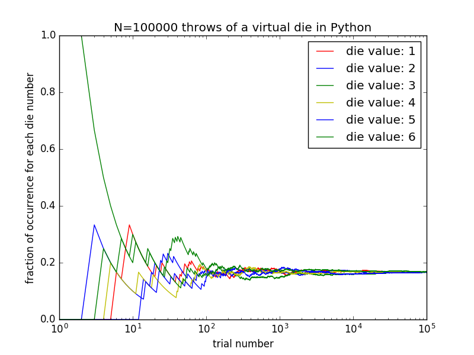

### Monte Carlo simulation in Python  

A Monte Carlo simulation is basically any simulation problem that somehow involves random numbers. Let's start with an example of throwing a die repeatedly for N times. We can simulate the process of throwing a die by the following python code,
```python
def throwFairDie():
    import random as rnd
    return rnd.randint(1, 6)
```

Now, each time the function is called, it returns a random value for one throw of a virtual die,
```python
throwFairDie()
```
    6

```python
throwFairDie()
```
    1

```python
throwFairDie()
```
    4

```python
throwFairDie()
```
    1

This is likely one of the simplest examples of [Monte Carlo simulations](https://en.wikipedia.org/wiki/Monte_Carlo_method). Now suppose we wanted to make sure that the die is fair, meaning that each number (out of 6 possibilities) only appears with a frequency of $1/6$ over many throws of the die. To test this hypothesis, we could write the following code,
```python
import numpy as np

def throwFairDie():
    import random as rnd
    return rnd.randint(1, 6)

def getMeanDieValue(n=10000):
    meanDieValue = np.zeros((n,6),dtype=np.double)
    randomThrow = throwFairDie() - 1        # assign the first value to the above array
    meanDieValue[0,randomThrow] = 1.0 / 1.0 # one try so far, one success for the die value that is obtained.
    for i in range(1,n):
        randomThrow = throwFairDie() - 1
        meanDieValue[i,randomThrow] = 1.0   # add one success for the value obtained
        meanDieValue[i,:] += meanDieValue[i-1,:]    # combine the recent success with the total number of successes from previous tries.
        meanDieValue[i-1,:] /= np.double(i)  # Now normalize the values form the last try to the total number of tries.
    meanDieValue[-1:,:] /= np.double(n)  # Now normalize the very last try to the total number of tries.
    return meanDieValue
```

What this function does, is that it throws a die for given input number of times (n=10000 by default if not given as input), and then calculates for each new try, how many times each of the die values have occurred so far, and then finally outputs all the result as numpy `double` array, each row of which contains the number of successes for each of the 6 die values. Normally, if the die is fair, you would expect that with more tries, the average number of successes for each try would converge more and more to the canonical value $1/6\sim0.1667$. We can test this, by calling the function with a large number of tries, and checking the values in the last row of the output array,
```python
print( getMeanDieValue()[-1:,:] )
```
    [[ 0.1645  0.1668  0.1683  0.1664  0.169   0.165 ]]

```python
print( getMeanDieValue(n=100000)[-1:,:] )
```
    [[ 0.16488  0.1665   0.16635  0.16841  0.1661   0.16776]]

A better approach would be to plot the output as a function of the number of tries and see if the results for each of possible die outcomes do indeed converge to the canonical value or not.
```python
import numpy as np
import matplotlib.pyplot as plt

nDieValues = 6 # 6 possible values for a die throw
nTrial = 100000 # total number of die throws
meanDieValues = getMeanDieValue(n=nTrial)

fig = plt.figure( figsize=(9, 8) \
                , dpi= 300 \
                , facecolor='w' \
                , edgecolor='w' \
                ) # create figure object

ax = fig.add_subplot(1,1,1) # Get the axes instance
trial = np.linspace( 1 , nTrial+1 , nTrial )
lineTypes = ['r-','b-','g-','y-','b-','g-']
for i in range( nDieValues ) :
    ax.semilogx ( trial[:] \
                , meanDieValues[:,i] \
                , lineTypes[i] \
                ) # plot with color red, as line
ax.set_xlabel('trial number')
ax.set_ylabel('fraction of occurrence for each die number')
ax.legend(['die value: '+str(i) for i in range(1,7) ],loc="upper right")
ax.set_title('N={} throws of a virtual die in Python'.format(nTrial))
fig.savefig('fairDie.png', dpi=700) # save the figure to an external file
plt.show() # display the figure
```

You can see the output of the above code in the following figure,
<figure>
    
</figure>
<br>


## Exercise  

1. Monte Carlo approximation of the number Pi: [web-link](https://www.cdslab.org/recipes/programming/monte-carlo-approximation-of-pi/monte-carlo-approximation-of-pi)  

1. Understanding the Central Limit Theorem via random walk: [web-link](https://www.cdslab.org/recipes/programming/random-walk-central-limit-theorem/random-walk-central-limit-theorem)  

1. Monte Carlo sampling of distribution functions: [web-link](https://www.cdslab.org/recipes/programming/monte-carlo-sampling-of-distribution-functions/monte-carlo-sampling-of-distribution-functions)  

1. Simulating the Monty Hall game: [web-link](https://www.cdslab.org/recipes/programming/simulating-monty-hall-game/simulating-monty-hall-game)  

1. Regression: obtaining the most likely mean and standard deviation of a set of Standard Normally Distributed Random Variables: [web-link](https://www.cdslab.org/recipes/programming/regression-standard-normal-distribution/regression-standard-normal-distribution)  

1. Regression: Predicting the global land temperature of the Earth in 2050 from the past data: [web-link](https://www.cdslab.org/recipes/programming/regression-predicting-future-global-land-temperature/regression-predicting-future-global-land-temperature)  
