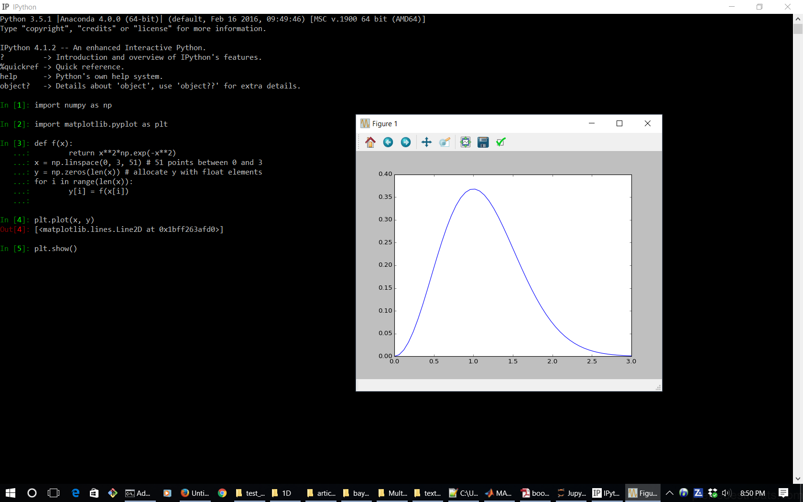
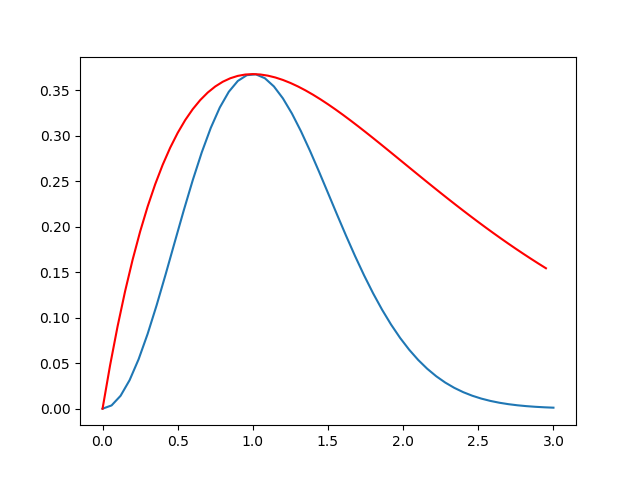
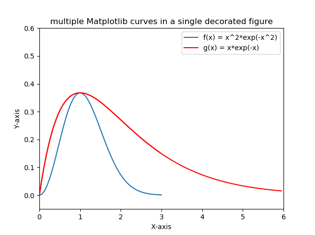
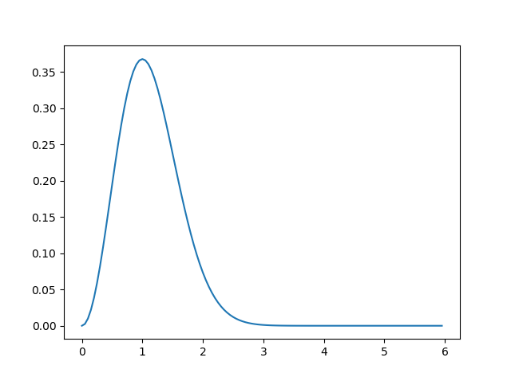
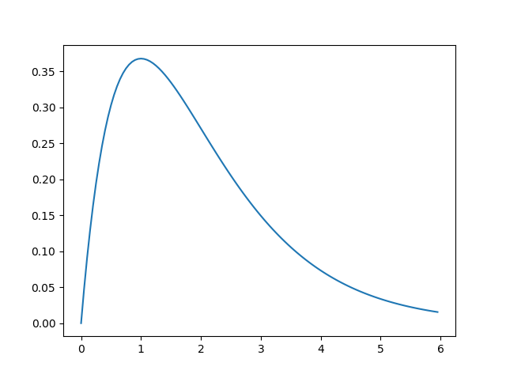
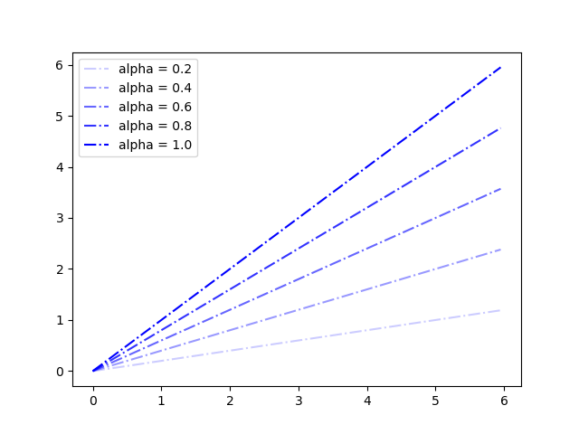
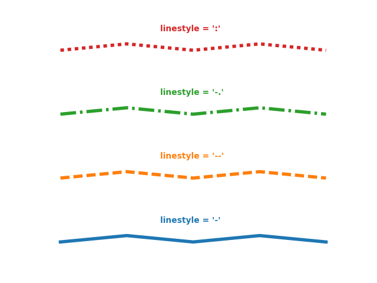
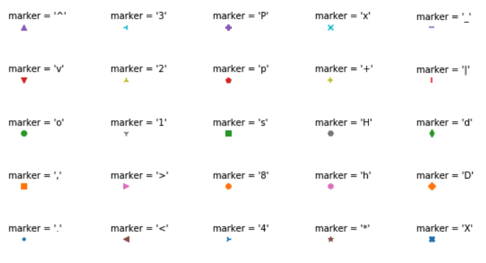
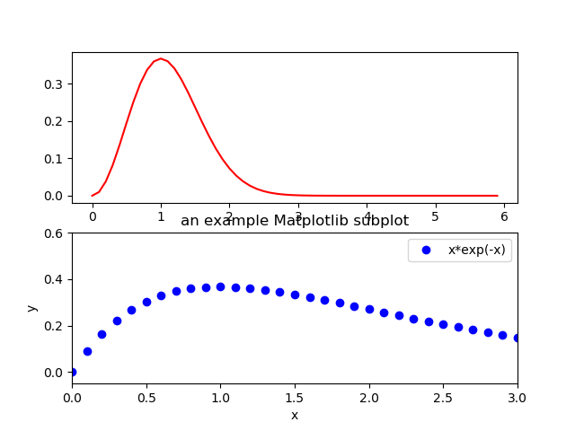
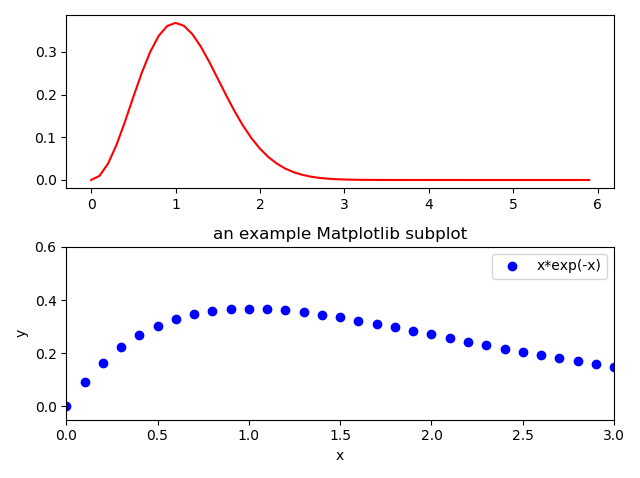

## 2D-plotting in `matplotlib`  

As discussed before, `matplotlib` is the workhorse of visualization in Python and therefore, it should always be your first choice, before trying anything else. To see how plotting with `matplotlib` works, let's start with a simple example of 2D curve plotting,  

```python
import numpy as np
import matplotlib.pyplot as plt
def f(x):
    return x**2*np.exp(-x**2)
x = np.linspace ( start = 0.    # lower limit
                , stop = 3      # upper limit
                , num = 51      # generate 51 points between 0 and 3
                )
y = f(x)    # This is already vectorized, that is, y will be a vector!
plt.plot(x, y)
plt.show()
```

If you try the above code in IPython, the out on screen would be something like the following,  

<figure>
    
</figure>

`matplotlib.pyplot` is a collection of command-style functions and methods that have been intentionally made to work similar to MATLAB plotting functions. Each `pyplot` function makes some changes to a figure. For example, it can create a figure, like `plt.plot()` in the above example, or decorates the plot with labels, texts, etc, as will be seen below.  

In Jupyter Notebook, you can include `%matplotlib inline` to avoid having to call `plt.show()` every time that you want to make a plot.

In `matplotlib.pyplot` various states are preserved across function calls. Therefore, any further plotting commands will add to the existing tasks that have been so far performed on the current figure and plotting area, and the plotting functions are directed to the **current axes** (i.e., the *axes part* of a figure).  

When adding arguments to `plot()` function or in general, any other function in Python (or any other programming language), I highly recommend you to write each of the input arguments to the function on a separate line, just like what I have done in the above with `np.linspace()` where each one of its input arguments appears on a separate line. This way, at any point, if you don't need any of the input arguments, you can simply comment it out without affecting or changing the rest of your code. You will see the benefits of this approach of coding in particular with the visualization functions that take many optional arguments as input, and you will frequently need to experiment with those options by repeatedly adding or commenting them out of your code. This way, you will also be able to add comments to the end of the line for each of the input arguments, as I have done in the above example.


### Plotting multiple curves in one figure  

Now, suppose you want to add another curve to the same figure that you created in the previous section, for example, the curve corresponding to the following mathematical function,  

$$
g(x) = x \times \exp\big(-x\big)~,
$$

Then, all you would need to do is to add the follwing lines of code to your previous code snippet,  

```python
def g(x):
    return x*np.exp(-x)
xx = np.arange  ( start = 0.
                , stop = 3.
                , step = 0.05
                ) # generate points between start and stop with distances of step apart from each other
yy = g(xx)
plt.plot( xx
        , yy
        , 'r-'  # plot with the color red, as line
        )
```

This will modify your existing figure to something like the following,  

<figure>
    
</figure>

### Setting the limits of the plot's axes  

The plot of the above figure has an obvious problem: It does not seem to show the entire important range of the new function that is represented by the red-curve. To fix this issue, we should increase our curve data `(xx, yy)` to cover the range of interest, and then set the limits of both X and Y axes to our desired ranges,  

```python
xx = np.arange  ( start = 0.
                , stop = 6.
                , step = 0.05
                ) # generate points between start and stop with distances of step apart from each other
plt.plot( xx
        , g(xx)
        , 'r-'  # plot with color red, as line
        )
plt.axis([0, 6, -0.05, 0.6]) # [xmin, xmax, ymin, ymax]
```

which will modify the existing open figure in IPython (Jupyter) environment to the following,  

<figure>
    
</figure>

### Adding the axis-labels, figure-title, and legends  

We can further decorate the generated figure by adding the relevantr information to it like the following,  

```python
plt.xlabel('X-axis')
plt.ylabel('Y-axis')
plt.legend( [ 'f(x) = x^2*exp(-x^2)'   # This is f(x)
            , 'g(x) = x*exp(-x)'       # This is g(x)
            ] )
plt.title('multiple Matplotlib curves in a single decorated figure');
```

This will modify the existing figure to the following,  

<figure>
    
</figure>

### Saving figures as external files  

Finally, we can save the generated figure in the file-format of our interest, for example, PDF, by the following command,  

```python
plt.savefig('multipleCurvesFullRangeDecorated.pdf') # produces a PDF file containing the figure
```

This will generate a [PDF file](multipleCurvesFullRangeDecorated.pdf) that will be located in the current working directory of your Python environment. Alternatively, you could save it as a PNG file or any other popular image format by simply using the image format file-extension, like the following,  
```python
plt.savefig('multipleCurvesFullRangeDecorated.png') # produces a PNG file containing the figure
```

### Working simultaneously with multiple open figures  

There are times that you want to plot multiple curves, but each one in a separate figure. To do so, you can use `plt.figure()` whenever you want to create a new figure environment. For example, the two curves superposed on each other in the previous plots could be separated from each other with the following code,  

```python
def g(x):
    return x*np.exp(-x)
def f(x):
    return x**2*np.exp(-x**2)
x = np.arange   ( start = 0.    # upper limit
                , stop  = 6.    # lower limit
                , step  = 0.05  # step-size (distance between the points)
                ) # generate points between start and stop with distances of step apart from each other
plt.figure(1)
plt.plot( x, f(x) )    # plot f(x)
plt.figure(2)
plt.plot( x, g(x) )  # plot g(x)
```

This will generate the following two separate figures in the Python environment,  

<figure>
    
    
</figure>

Notice the use of integer numbers as input arguments to the function `figure()` in the above. This integer represents the ID of the figure by which the figure is represented and can be called when needed. It is always a good practice to provide this number so that if you need to activate a specific figure, you could simply do so by recalling the figure by its ID number through the same command `plt.figure(ID)`.

Notice that when you call the plotting functions in Python, for example, `plt.plot(x,g(x))`, an output is written on the command-line by the Python interpreter, which is the name of function returned, such as, `[<matplotlib.lines.Line2D at 0x1e438e87eb8>]`. Since this output is not always interesting or needed, you can put a `;` at the end of the command `plt.plot(x,g(x));` to avoid the print-out.

### Adding transparency to the plot objects  

It may happen frequently that you may need to represent some lines or objects in your plots at varying levels of transparency. This can be done by the `alpha` optional argument to the `plot()` function,  

```python
import matplotlib as mpl
x = np.arange   ( start = 0.    # upper limit
                , stop  = 6.    # lower limit
                , step  = 0.05  # step-size (distance between the points)
                ) # generate points between start and stop with distances of step apart from each other
thisLegend = []
mpl.use('Agg')   # avoid displaying the figure in Python environment
for thisAlpha in [0.2,0.4,0.6,0.8,1.0]:
    plt.plot( x, thisAlpha*x, 'b-.', alpha = thisAlpha );   # -. represents dashed-dotted line-style
    thisLegend.append("alpha = {}".format(thisAlpha))
plt.legend( thisLegend );
plt.savefig("transparency.png")
```

This will export the following figure to an external PNG file in the current working directory of Python, like the following,  

<figure>
    
</figure>

### Plotting line-styles and symbols  

Just as in MATLAB, there are several line-style options available also in Python,  

<figure>
    
</figure>

Similarly, one can use different symbols to generate scatter plots, instead of lines, using either `scatter()` or `plot()` functions,  

<figure>
    
</figure>

#### Execise

Modify the following code to generate a figure like the following,  
<figure>
    
</figure>

```python
import numpy as np
import matplotlib as mpl
import matplotlib.pyplot as plt
x = np.arange   ( start = 0.    # upper limit
                , stop  = 6.    # lower limit
                , step  = 0.5   # step-size (distance between the points)
                ) # generate points between start and stop with distances of step apart from each other
thisLegend = []
#mpl.use('Agg')   # avoid displaying the figure in Python environment
LineStyle = [ "-", "--", "-.", ":", "None" ]
Marker = [ "<", "^", "x", "+", "d" ]
Color = ['blue','red','green','black','purple']
Alphas  = [0.2,0.4,0.6,0.8,1.0]
for i in range(len(Alphas)):
    plt.plot( x
            , Alphas[i]*x
            , color = Color[i]
            , alpha = Alphas[i]
            , Marker = Marker[i]
            , linestyle = LineStyle[i]
            , linewidth = 2 # set the linewidth to 1
            );
    thisLegend.append   ("alpha = {}".format(Alphas[i])
                        )
plt.legend  ( thisLegend
            , loc = "upper left"
            );
plt.savefig("transparencyWithSymbols.png");
```

There are many other figure/plot attributes that can be set when making a plot, for example, the major and minor tick styles, the font size for all different elements of the figure and the plot, the size of the figure and, etc. The discussion of all of them is not possible within the limited time and space available here. However, further information all of these properties can be found in `matplotlib`'s [reference manual](https://matplotlib.org/api/pyplot_api.html).

## Subplots in `matplotlib`  

Suppose you wanted to generate the same curves as in the above example, but each in a different plot, but with all of the plots in the same figure. One way to do this would be like the following,  

```python
import numpy as np
import matplotlib as mpl
import matplotlib.pyplot as plt
x = np.arange   ( start = 0.    # upper limit
                , stop  = 6.    # lower limit
                , step  = 0.1   # step-size (distance between the points)
                ) # generate points between start and stop with distances of step apart from each other
def g(x):
    return x*np.exp(-x)
def f(x):
    return x**2*np.exp(-x**2)

plt.figure()            # generates a new figure as in MATLAB

plt.subplot(2,1,1)      # create a 2-row, 1-column subplot, and this is the 1st subplot.
plt.plot(x, f(x), 'r-') # plot with color red, as line

plt.subplot(2,1,2)      # create a 2-row, 1-column subplot, and this is the 2nd subplot.
plt.plot(x, g(x), 'bo') # plot with color blue, as points

plt.xlabel('x')
plt.ylabel('y')
plt.legend(['x*exp(-x)'])
plt.axis([0, 3, -0.05, 0.6]) # [xmin, xmax, ymin, ymax]
plt.title('an example Matplotlib subplot')

plt.savefig('two_by_one_subplot.png')
plt.show()
```

The output of the code is a PNG figure [available here](two_by_one_subplot.png),  

<figure>
    
</figure>

Note that since the decorations (i.e., axis labels, legend, title, ...) appeared only for the second subplot, only the second one in the figure above is decorated with plot title, legend, etc. Also, note again that, the `figure()` method creates a new plot window on the screen that will contain both subplots.  

Also, note that the subplots in the above figure look a bit too-squished and overlap each other. In such cases, one could use `tight_layout()` method to automatically adjust the paddings of the subplots and their organization within the figure. For example, by simply typing,  

```python
plt.tight_layout()
```

one would automatically get the following padded subplots that peacefully coexist,  

<figure>
    
</figure>

